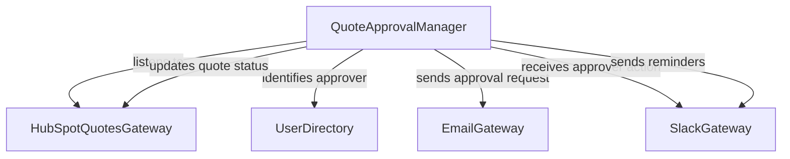

# Example: HubSpot Automated Quote Approval

## Problem statement

Automate your HubSpot quote approval workflow to close deals faster and kick up your sales efficiency.

https://zapier.com/templates/details/deal-desk-manage-hubspot-quote-approvals-slack

## Steps

1. A sales rep submits a new quote for approval in HubSpot Quotes
1. The system identifies approvers based on the specific concessions asked for and the rep's reporting chain
1. An email approval request gets sent to the designated approvers
1. The approver reviews the quote details and takes action—approve, reject, or request changes—in Slack
1. If approved, the quote is marked as such in HubSpot, and the rep is free to send it
1. If concessions aren't approved, the quote is marked rejected, and reps can resubmit
1. If quotes aren't approved in 24 hours, stakeholders are tagged in the thread as a reminder

## System objects and relationships

