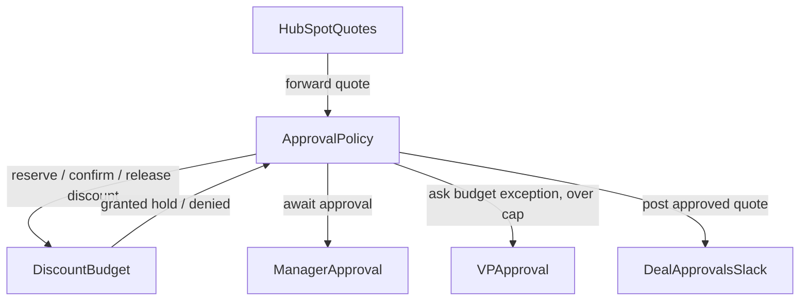
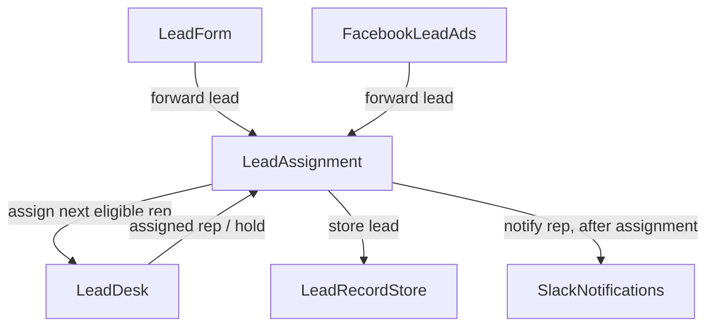

# Example: Custodian — shared / concurrent logic-state

## Problem statement

Some workflow rules constrain an accumulator that spans many requests: a
cumulative cap, a per-entity rate-limit, a shared pool, a round-robin queue. When
requests arrive concurrently, the object that *decides* and the state that *holds
the invariant* must not drift apart. This example shows the race that appears
when they live together, and the **Custodian** pattern that fixes it — a single
single-writer object that owns the invariant and decides atomically.

See [`docs/SHARED_STATE_DESIGN.md`](../docs/SHARED_STATE_DESIGN.md) for the full
model and the runtime mechanics this rests on.

## The race (why a plain business-logic object is not enough)

The per-object FIFO mailbox serializes message *processing*, not the
read-modify-write across a single plan's *lifetime*. A plan forks its working
state from master at creation and commits only when it completes; if it
**suspends** in between (an async tool, or an `ask` to a peer that resumes on a
later reply), the next message is processed against the *un-updated* master. Two
plans can both fork the same base, both decide "under cap," and the later commit
clobbers the earlier — a silent lost update.

This is not hypothetical: in
[`round-robin-lead-assignment.md`](round-robin-lead-assignment.md) the decider
`LeadAssignment` holds the per-rep counts **and** does an `ask` to
`SalesRepsTable` mid-decision. That `ask` is the suspension.

---

## Part A — Cumulative cap on one object ($50K quarter discount)

**Workflow rule:**

```
Every quote must be approved by the submitter's manager before it is recorded as
approved. Track the cumulative approved discount this quarter: if approving a
quote would push the cumulative total above $50K, escalate to the VP of Sales for
a budget exception first; otherwise the manager's approval is sufficient.
```

The suspension is **unconditional**: every quote — under cap or not — waits for
the manager's approval action, which arrives as a later reply. The cap check and
the final commit therefore straddle that wait. (The VP `ask` is only the over-cap
branch; it is not what creates the race.)

### Broken: decider owns the total, awaits manager approval mid-decision

```mermaid
sequenceDiagram
  participant HubSpot
  participant ApprovalPolicy
  participant Manager

  Note over ApprovalPolicy: total=25 committed (Q1 earlier)

  HubSpot->>ApprovalPolicy: Q2 (discount 24)
  Note over ApprovalPolicy: fork base=25; 25+24=49, under cap; await manager approval, SUSPEND (master still 25)
  HubSpot->>ApprovalPolicy: Q3 (discount 10)
  Note over ApprovalPolicy: fork base=25; 25+10=35, under cap; await manager approval, SUSPEND
  Manager-->>ApprovalPolicy: Q2 approved; set total=49
  Manager-->>ApprovalPolicy: Q3 approved; set total=35
  Note over ApprovalPolicy: recorded total=35, but actually approved 25+24+10 = 59 > 50, cap breached
```

| event | reads base | check | commit | recorded | actually approved |
|------|-----------|-------|--------|----------|-------------------|
| Q1 | 0 | 0+25 ≤ 50 | total=25 | 25 | 25 |
| Q2 | 25 | 25+24=49 ≤ 50 | total=49 | 49 | 49 |
| Q3 | 25 | 25+10=35 ≤ 50 | total=35 | **35** | **59 ✗** |

Both quotes follow the *normal* (under-cap) path; the cap is breached anyway,
because each forked the same base=25 before either committed.

### Fixed: a `discount-budget` Custodian + reserve/confirm/release

The Custodian owns the total. The cap check and the **reserve** are one
non-suspending message that happens *on arrival*, before the manager wait — so a
concurrent quote immediately sees the reduced headroom. The slow manager approval
(and any VP escalation) happens after the hold exists; confirm/release reconciles.



```mermaid
sequenceDiagram
  participant ApprovalPolicy
  participant DiscountBudget
  participant Manager

  Note over DiscountBudget: committed=25, holds=[]

  ApprovalPolicy->>DiscountBudget: reserve 24 (Q2)
  Note over DiscountBudget: 25 + 24 = 49, under cap; hold h2 (held). committed=25, held=24
  DiscountBudget-->>ApprovalPolicy: granted h2
  ApprovalPolicy->>Manager: await approval for Q2

  ApprovalPolicy->>DiscountBudget: reserve 10 (Q3)
  Note over DiscountBudget: 25 + held 24 + 10 = 59, over cap; DENY
  DiscountBudget-->>ApprovalPolicy: denied; escalate Q3 to VP, hold the quote

  Manager-->>ApprovalPolicy: Q2 approved
  ApprovalPolicy->>DiscountBudget: confirm h2
  Note over DiscountBudget: committed=49, holds=[]
```

The reservation makes Q2's 24 visible to Q3 immediately, so the cap holds. If the
manager rejects Q2, `ApprovalPolicy` sends `release h2` and the headroom returns
— no "undo the approval" needed.

---

## Part B — Round-robin per-rep cap (shared queue forces one owner)

**Workflow rule** (from [`round-robin-lead-assignment.md`](round-robin-lead-assignment.md)):

```
Assign leads round-robin, but no rep may receive more than 2 leads per day. Skip
a rep already at the daily cap (rotate to the back without assigning); if every
rep is capped, hold the lead and alert the sales manager. Reset per-rep counts at
the start of each day.
```

Here the assignment **is** the commit (nothing fallible follows the check), so
the Custodian uses **admit + commit** — no two-phase. The key change from the
base example: the queue and the counts move *into* the Custodian, and the
position lookup is no longer a suspending `ask` to a separate table — it is a
local read inside the one atomic decision.



`LeadDesk` is the Custodian: single writer of `{ queue, counts, date }`. On each
lead it performs — in one non-suspending message — lazy daily reset, walk the
queue skipping capped reps (rotating them), assign + increment + rotate the
eligible rep, or hold-and-alert if all capped. The Slack notify is a **`tell`
after** the commit, outside the critical section.

> **Why one owner, not one-per-rep:** the rotation queue couples all reps — even
> leads to different reps read/mutate position 1 — so the invariant cannot be
> sharded by rep. Contrast Part C.

---

## Part C — Partitioned, shardable: per-SKU reorder window & cross-instance pool

Per-SKU reorder counts ([`inventory.md`](inventory.md)) have **no
cross-partition shared state** — SKUs are independent — so the invariant is
shardable. Two valid shapes:

- **One Custodian, partitioned dict:** `reorder-window` owns
  `{ "SKU-A": {sent:[…]}, "SKU-B": {…} }`. Simple; serializes everything.
- **One Custodian per SKU:** spawn `reorder-window-{sku}` from a class
  (`register_class`/`spawn`). Different SKUs run in parallel, each the single
  writer of its own partition — safe *only because* SKUs share nothing.

The **rolling 7-day window** is enforced by lazy reset: each entry stores sent
timestamps; on every touch, drop entries older than `now − 7d` (per SKU). "After
a week, the count resets for entities out of the window" falls out for free.

The cross-instance budget pool is the mirror image: many `Order` instances spawn
from an `Order` class, each with private state, so the shared pool has **no
natural owner** → one shared `discount-budget` Custodian (as in Part A) that all
Order instances reserve against.

| case | shared structure? | shape |
|------|-------------------|-------|
| $50K quarter cap | one global total | one Custodian |
| round-robin per-rep | the rotation queue | one Custodian (not shardable) |
| per-SKU reorder window | none across SKUs | one Custodian w/ dict, **or** one per SKU |
| cross-instance Order pool | one shared pool | one Custodian, all instances reserve |

---

## The atomicity rule, in one line

The Custodian's decision (read → check → reserve/admit → commit) must finish in a
**single message with no suspending step** (no async tool, no ask-and-wait)
between the fork and the commit. Slow or fallible work (a VP `ask`, an external
write) goes *after* the reservation, reconciled by confirm/release.
