# Example: HubSpot Automated Quote Approval

## Problem statement

Automate your HubSpot quote approval workflow to close deals faster and kick up your sales efficiency.

https://zapier.com/templates/details/deal-desk-manage-hubspot-quote-approvals-slack

## Template

1. A sales rep submits a new quote for approval in HubSpot Quotes
1. The system identifies approvers based on the specific concessions asked for and the rep's reporting chain
1. An email approval request gets sent to the designated approvers
1. The approver reviews the quote details and takes action—approve, reject, or request changes—in Slack
1. If approved, the quote is marked as such in HubSpot, and the rep is free to send it
1. If concessions aren't approved, the quote is marked rejected, and reps can resubmit
1. If quotes aren't approved in 24 hours, stakeholders are tagged in the thread as a reminder

## Grounded steps

1. A sales rep submits a new quote for approval in HubSpot Quotes
1. The system identifies approvers based on the specific concessions asked for and the rep's reporting chain
1. An email approval request gets sent to the designated approvers
1. The approver reviews the quote details and takes action—approve, reject, or request changes—in the #quote-approvals channel on Slack
1. If approved, the quote is marked as such in HubSpot, and the rep is free to send it
1. If concessions aren't approved, the quote is marked rejected, and reps can resubmit
1. If quotes aren't approved in 24 hours, the Deal Desk Team is tagged in the thread as a reminder

## System objects and relationships

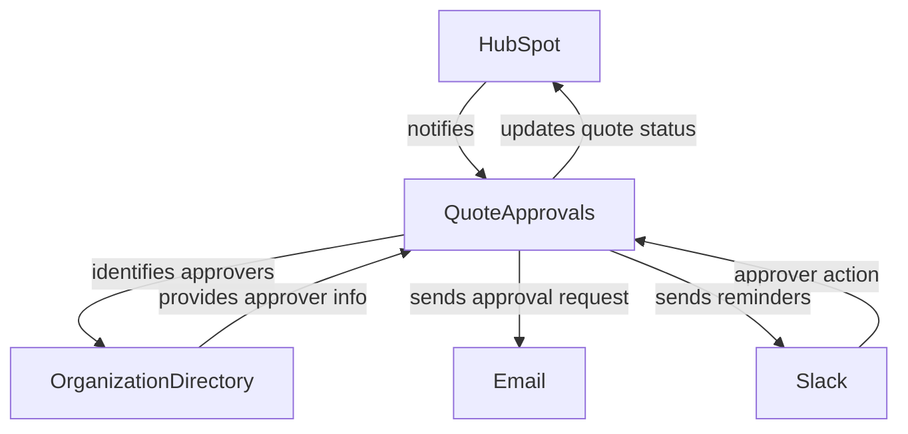

## Sequence diagrams

### Base scenario

A new quote is submitted for approval; a quote approval request is created in HubSpot; the system identifies approvers; an approver approves in Slack, quote gets marked as approved in HubSpot.

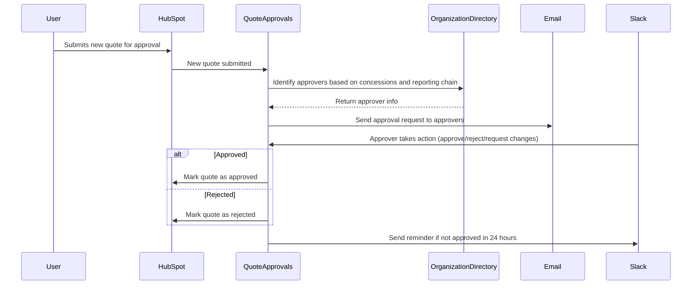

### Scenario: State-dependent rule — cumulative discount cap

**Workflow rule (to QuoteApprovals):**

```
Track the cumulative approved discount dollars for the current quarter. While the
running total is at or below $50K, route quotes through the normal approval flow.
If approving a quote would push the cumulative total above $50K, do not route it
normally — escalate to the VP of Sales for a budget exception and hold the quote
(do not mark it approved or add it to the total).
```

Unlike the per-quote rules above, this constraint is **value-dependent across requests**: whether a quote can follow the normal flow depends on a running total of discounts already approved this quarter — a figure that lives in no single quote. The object must accumulate that total as state, test each new quote against the $50K ceiling, and switch to escalation once a quote would cross it (and keep escalating, since the cap stays exceeded).

With traditional programming this requires a persistent quarter-to-date accumulator, a reset at quarter boundaries, and branch logic for the crossing case. Here the rule is stated once and the object maintains the total itself.

#### Event sequence (cumulative cap = $50K/quarter)

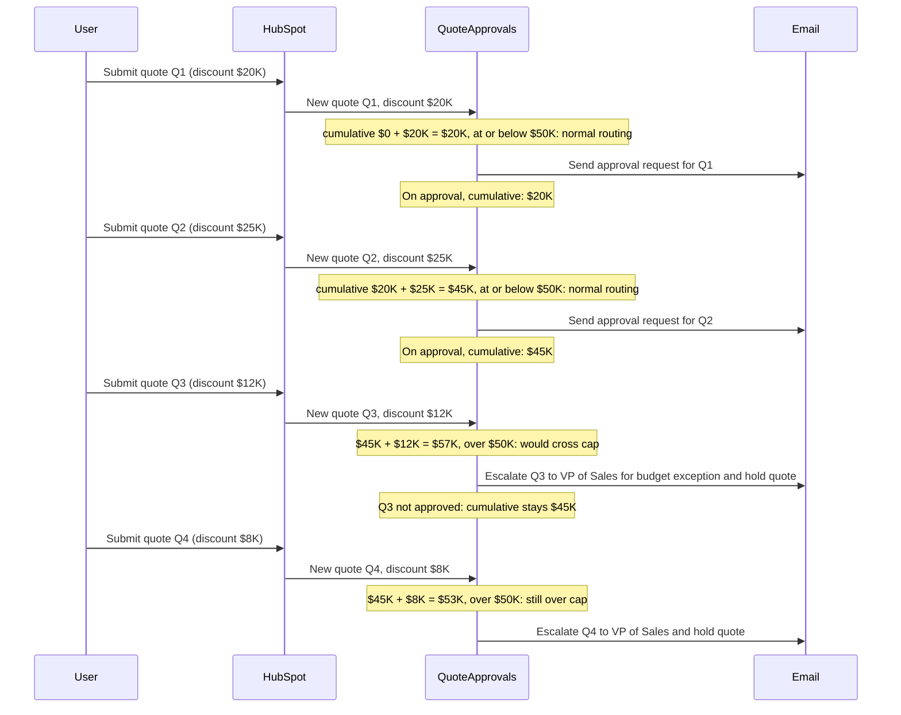

### Scenario: Simple conflict resolution

**Modification 1 (to QuoteApprovals):**

```
Quotes under $10K auto-approve
```

**Modification 2 (to Slack):**

```
All approvals must be posted to #quote-approvals with approver name
```

In this scenario, the system receives two conflicting instructions: QuoteApprovals is told to auto-approve quotes under $10K, while Slack is told that all approvals must be posted in #quote-approvals with the approver's name. Yet, autoapproved quotes won't have an approver name to post in Slack. The system needs to determine how to handle this conflict. 

With traditional code based programs, the unavailability of the approver name for auto-approved quotes would likely be an edge case that isn't handled, resulting in errors or missing notifications in Slack.

#### Modification sequence

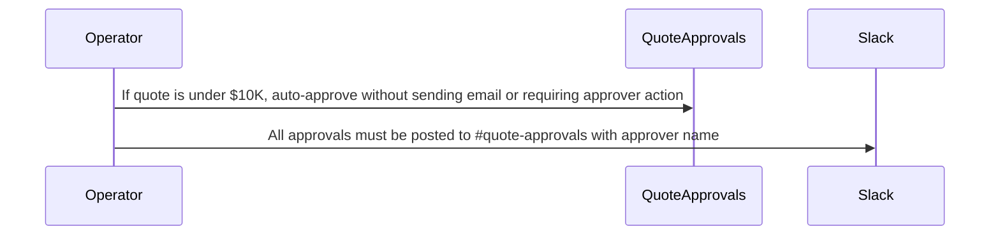

#### New event sequence

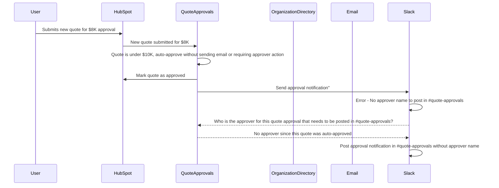

### Scenario: Underspecified conflict resolution with probablistic state
**Modification (to QuoteApprovals):**

```
Enterprise quotes require VP approval
```

In this scenario, QuoteApprovals is given a new requirement that enterprise quotes require VP approval. However, in this example, the system doesn't have enough information to determine whether ACME corp is an enterprise customer and who the required approver should be. LLM-objects communicate with each other to identify the missing information and determine the appropriate approver. The confidence level of the system can be be updated as it gathers more information, and it can even seek clarification from the user if needed.
With traditional programming, this would likely result in a failure to route the approval request correctly, causing delays and possibly lost deals.

#### Modification sequence

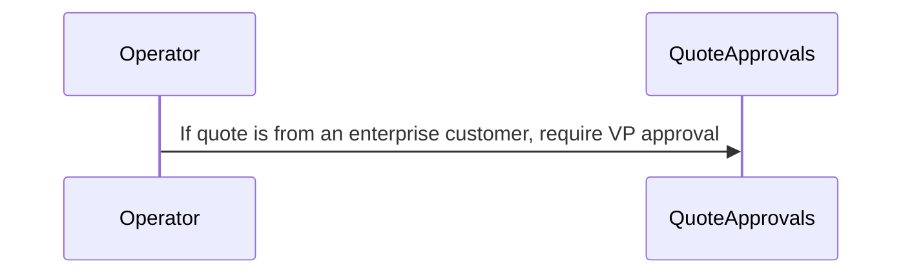

#### New event sequence

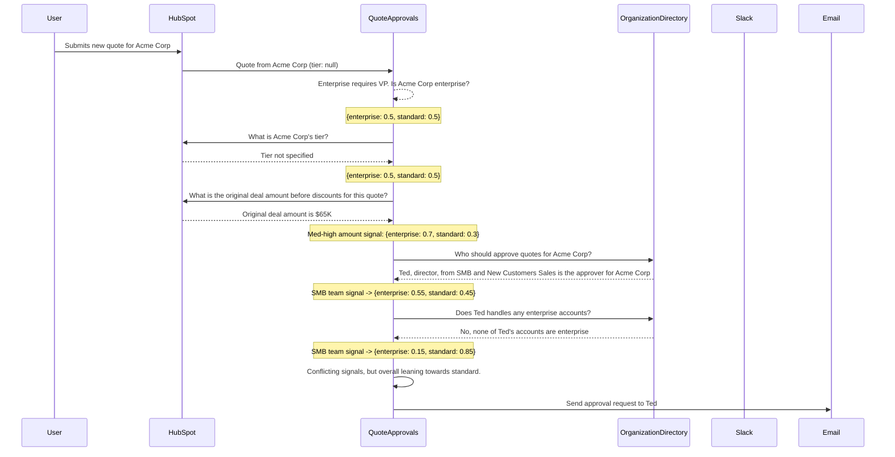

### Scenario: Conflicting instructions, no breakage

**Modification 1 (to QuoteApprovals):**

```
Quotes under $10K auto-approve
```

**Modification 2 (to QuoteApprovals):**

```
From now on, All quotes to new customers require manager approval
```

In this scenario, QuoteApprovals receives two conflicting instructions: auto-approve quotes under $10K, and require manager approval for all quotes to new customers. If a quote is submitted for a new customer that's under $10K, the system needs to determine which instruction takes precedence. The system potentially can demonstrate proactiveness by recognizing the conflict and seeking clarification, or it can apply a default conflict resolution strategy (e.g., stricter rule wins, or most recent instruction takes precedence).
With traditional programming, this would likely require additional code to handle this specific edge case, and if not handled correctly, could lead to incorrect approvals or rejections.

#### Modification sequence

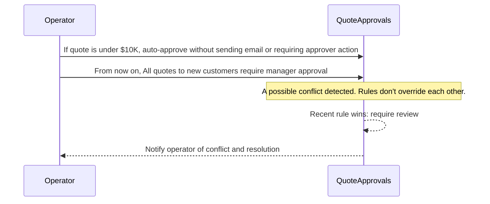

#### New event sequence

```mermaid
  participant User
  participant HubSpot
  participant QuoteApprovals
  participant OrganizationDirectory
  participant Email

  User->>HubSpot: Submits new quote for $8K for new customer
  HubSpot->>QuoteApprovals: New quote submitted for $8K for new customer
  QuoteApprovals->>QuoteApprovals: Quotes under $10K should be auto-approved, but new customer requires approval
  QuoteApprovals->>OrganizationDirectory: Identify manager approver for new customer
  OrganizationDirectory-->>QuoteApprovals: Return manager approver info
  QuoteApprovals->>Email: Send approval request to manager approver
```

### Scenario: Retroactive modification

**Modification (to QuoteApprovals):**

```
Effective immediately, any concessions involving discounts over 20% require CFO approval
```

A modification is made to the system that requires retroactive changes to existing quotes in the approval pipeline. With traditional programming paradigm requiring updated code is not enough. A migration script is needed to update existing quotes to comply with the new logic. With natural language programming, you can simply state the new requirement and the system can automatically identify which existing quotes are affected and update them accordingly.

#### Modification sequence

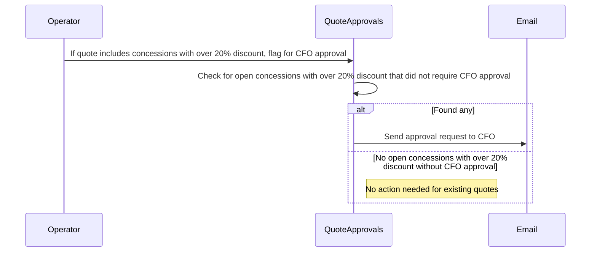

#### New event sequence

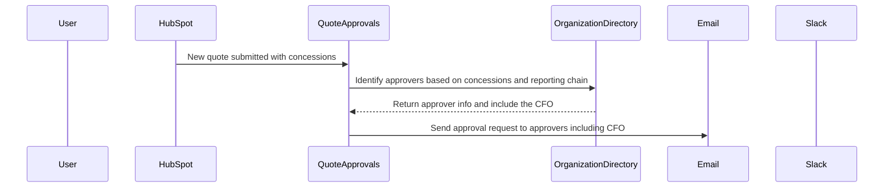

### Scenario with modification: Alternate approver vs. OOO routing

**Modification (to Email):**

```
If an approver is OOO, Email should route the request to their direct manager instead
```

In this example, the system is faced with conflicting instructions: an approval should be sent to the designated approver manager, if the approver is out-of-office. An approval request define an alternate approver (e.g., Bob) to route to when the primary approver (e.g., Alice) is unavailable. The system needs to determine which instruction takes precedence and how to route the approval request accordingly. Business context or system defaults may guide the decision.

**Conflict among:**
- **QuoteApprovals**: Knows alternate approver (Bob), doesn't know Alice is OOO
- **Email**: Knows Alice is OOO, doesn't know Bob is alternate
- **OrganizationDirectory**: Knows Carol is Alice's manager, doesn't know approval context

#### Modification sequence

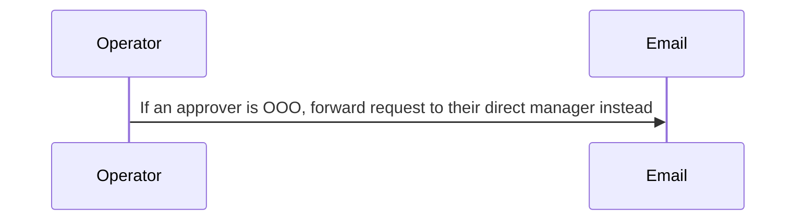

#### New event sequence

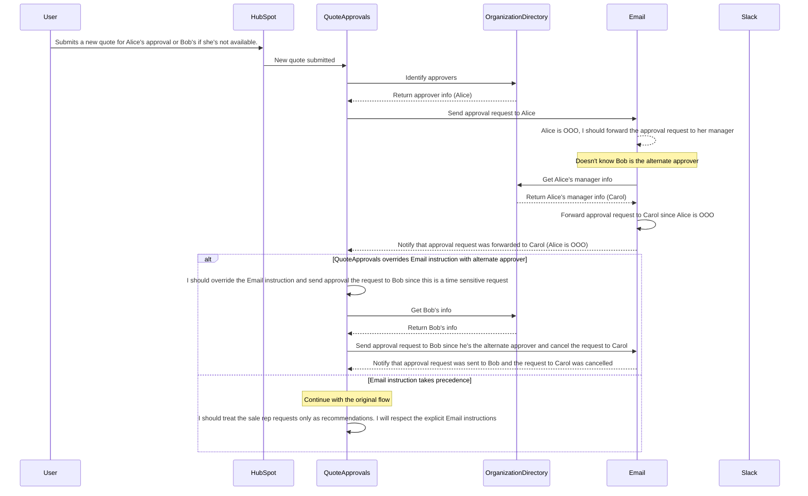

### Scenario with modification: 3 Conflicting instructions

**Modification 1 (to QuoteApprovals):**

```
Enterprise quotes must be approved by VP or above
```

**Modification 2 (to OrganizationDirectory):**

```
EMEA quotes must be approved by someone in the EMEA region
```

**Modification 3 (to Slack):**

```
If no approval in 4 hours, tag the assigned approver's manager in #quote-approvals
```

**The conflicts:**

QuoteApprovals vs. OrganizationDirectory: QuoteApprovals needs VP. OrganizationDirectory can only provide Bob (EMEA Director). No valid approver -- not a VP.
Slack vs. OrganizationDirectory: After 4 hours, Slack asks OrganizationDirectory for Bob's manager. Gets Carol (VP, APAC). Carol is VP—but not EMEA.
Slack vs. QuoteApprovals: Slack escalates to Carol. But QuoteApprovals never assigned Carol. Is Carol now the approver? Or just notified?

#### Modification sequence

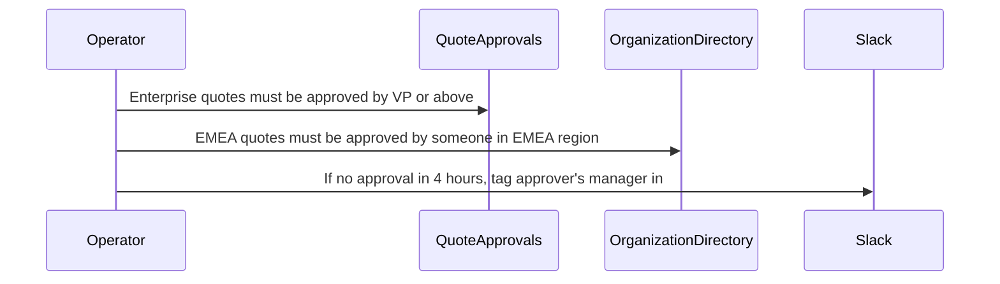

#### New event sequence

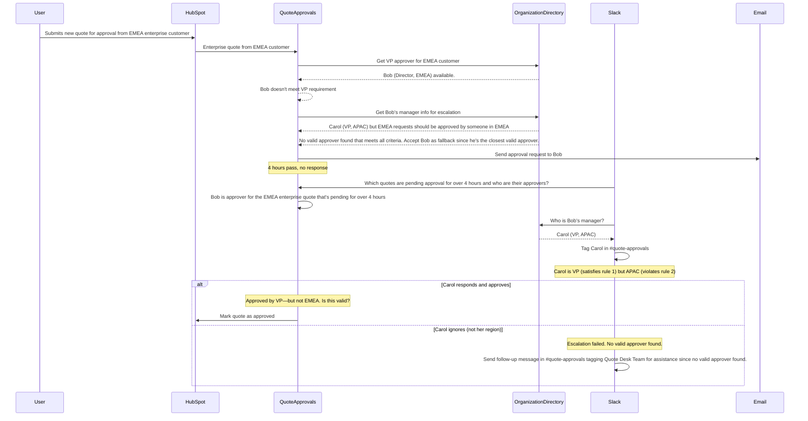

### Scenario: Negotiate state transition (without user intervention)

**Modification (to QuoteApprovals):**

```
Big deals needs CFO approval
```

In this scenario, QuoteApprovals receives a new instruction that big deals require CFO approval. However, "big deal" is an ambiguous term that isn't clearly defined in the system. The system needs to negotiate the definition of "big deal" by communicating with other objects to gather necessary information (e.g., historical deal sizes, company benchmarks) and potentially seek clarification from the operator. With traditional programming, this would likely require additional code to handle the ambiguity, and if not handled correctly, could lead to inconsistent application of the new rule.

#### Modification sequence

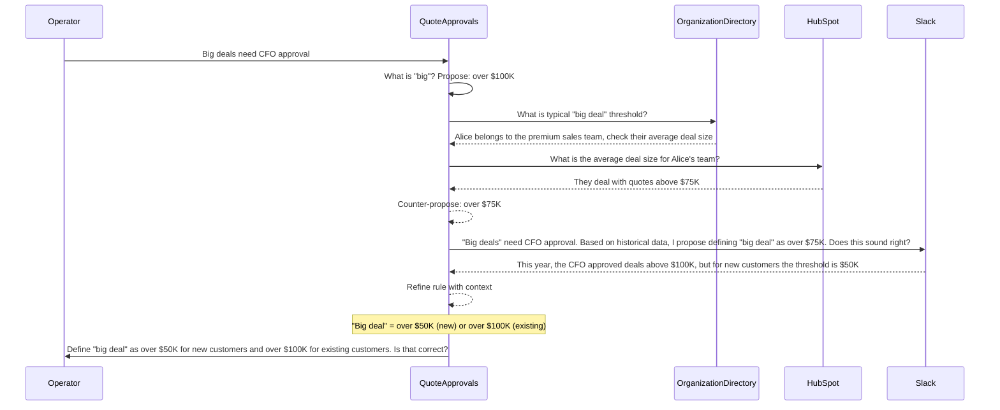