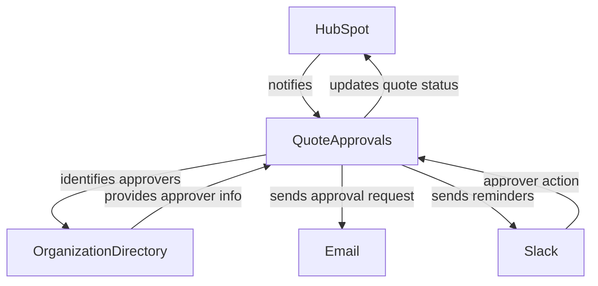
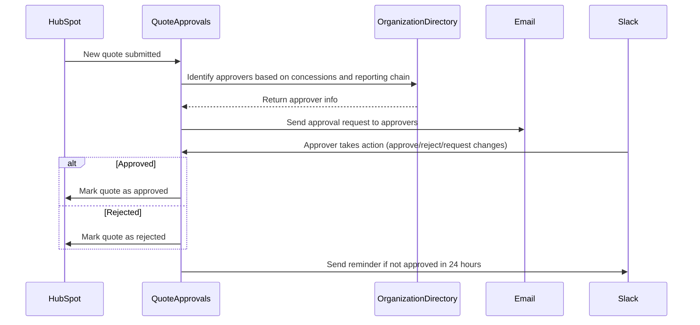
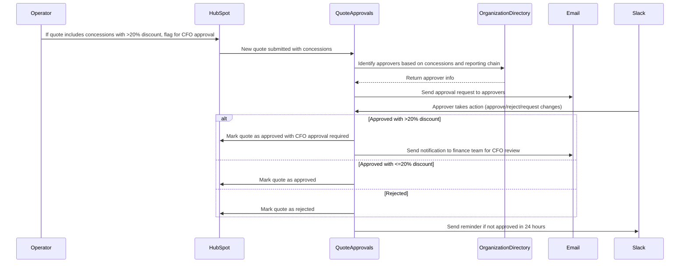
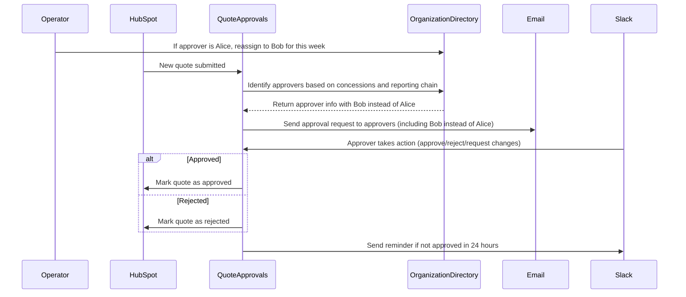
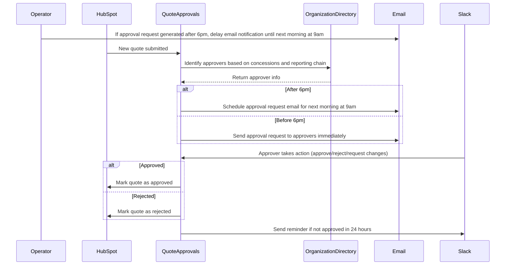
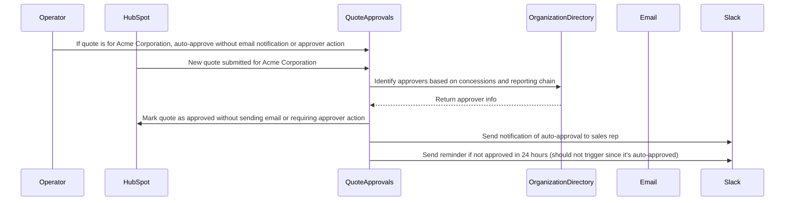
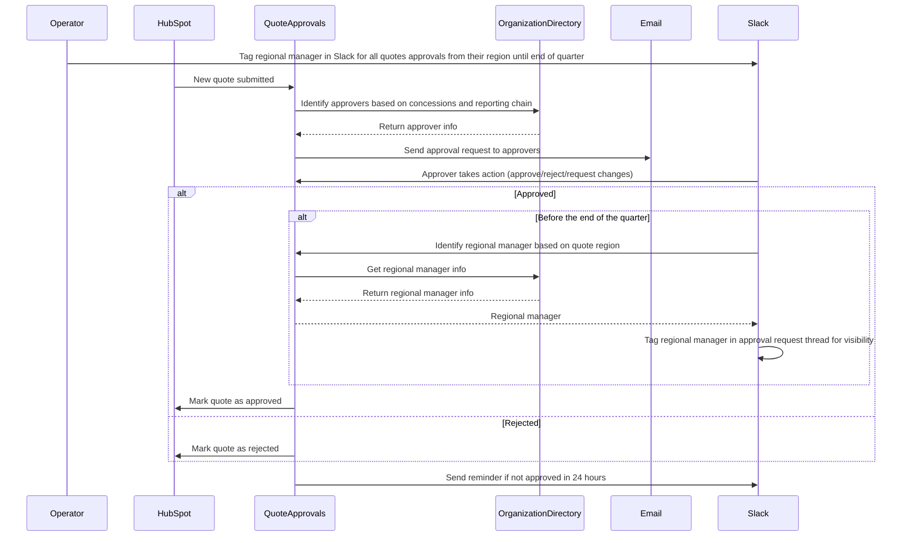

# Example: HubSpot Automated Quote Approval

## Problem statement

Automate your HubSpot quote approval workflow to close deals faster and kick up your sales efficiency.

https://zapier.com/templates/details/deal-desk-manage-hubspot-quote-approvals-slack

## Template

1. A sales rep submits a new quote for approval in HubSpot Quotes
1. The system identifies approvers based on the specific concessions asked for and the rep's reporting chain
1. An email approval request gets sent to the designated approvers
1. The approver reviews the quote details and takes action—approve, reject, or request changes—in Slack
1. If approved, the quote is marked as such in HubSpot, and the rep is free to send it
1. If concessions aren't approved, the quote is marked rejected, and reps can resubmit
1. If quotes aren't approved in 24 hours, stakeholders are tagged in the thread as a reminder

## Grounded steps

1. A sales rep submits a new quote for approval in HubSpot Quotes
1. The system identifies approvers based on the specific concessions asked for and the rep's reporting chain
1. An email approval request gets sent to the designated approvers
1. The approver reviews the quote details and takes action—approve, reject, or request changes—in the #quote-approvals channel on Slack
1. If approved, the quote is marked as such in HubSpot, and the rep is free to send it
1. If concessions aren't approved, the quote is marked rejected, and reps can resubmit
1. If quotes aren't approved in 24 hours, the Deal Desk Team is tagged in the thread as a reminder

## System objects and relationships

## Sequence diagrams

### Base scenario (no modifications)

### Scenario with modification: "Concessions involving discounts over 20% require CFO approval and a secondary notification to the finance team"

### Scenario with modification: "Alice is on vacation this week, reassign any approvals that would have gone to her to Bob"

### Scenario with modification: "For quotes approval requests sent after 6pm, send the email notification the next morning at 9am instead of immediately"

### Scenario with modification: "All quotes for the Acme Corporation should be automatically approved without sending email notifications or requiring approver action"

### Scenario with modification: "Tag the regional manager in Slack on all quotes approvals from their region until the end of the quarter for additional visibility"

