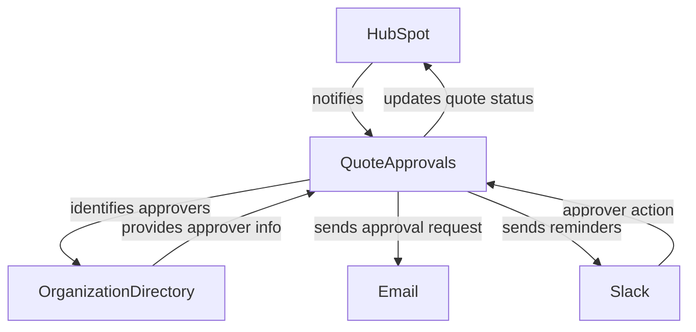
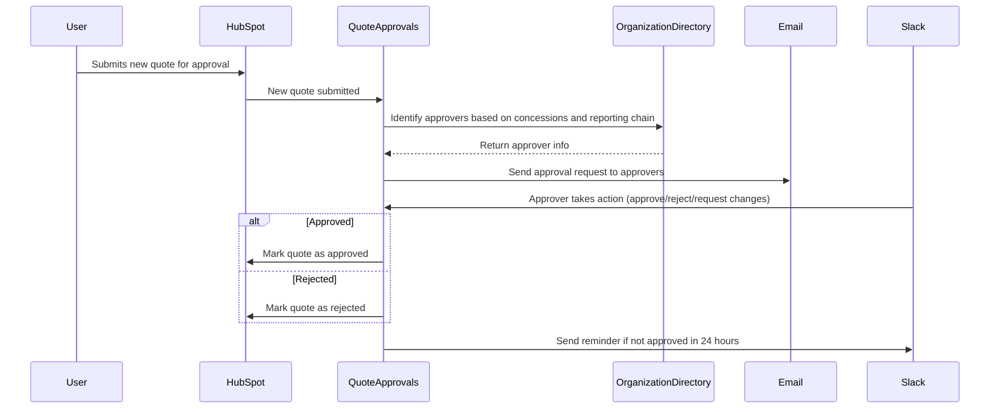
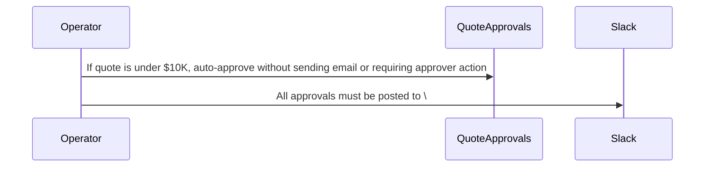
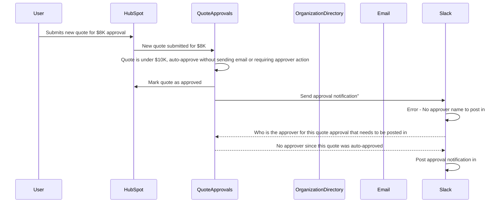
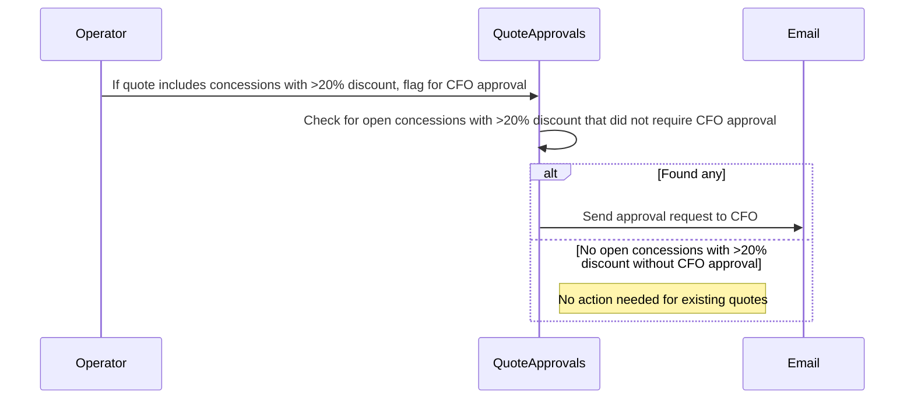
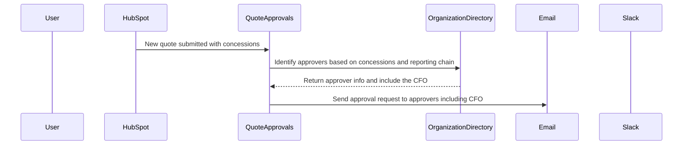
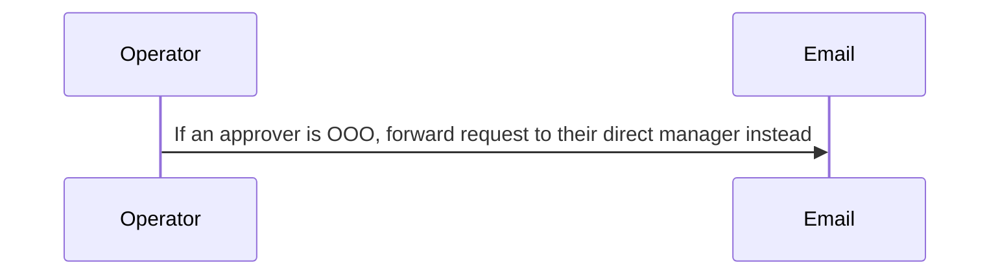
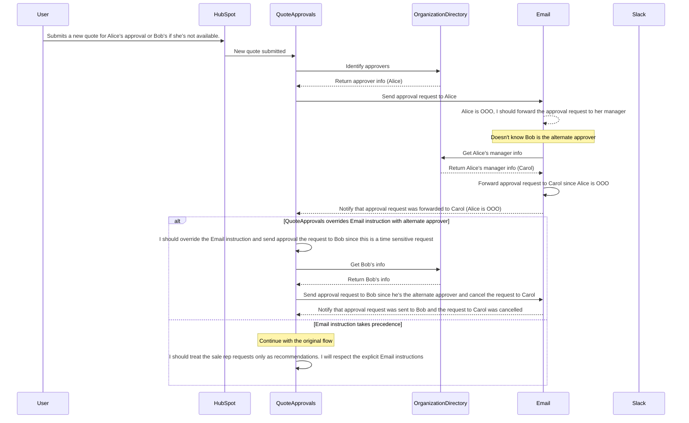
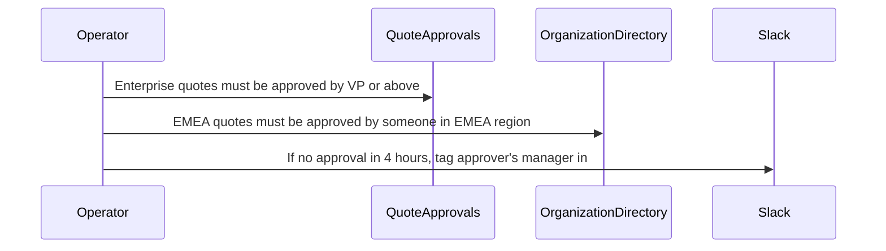
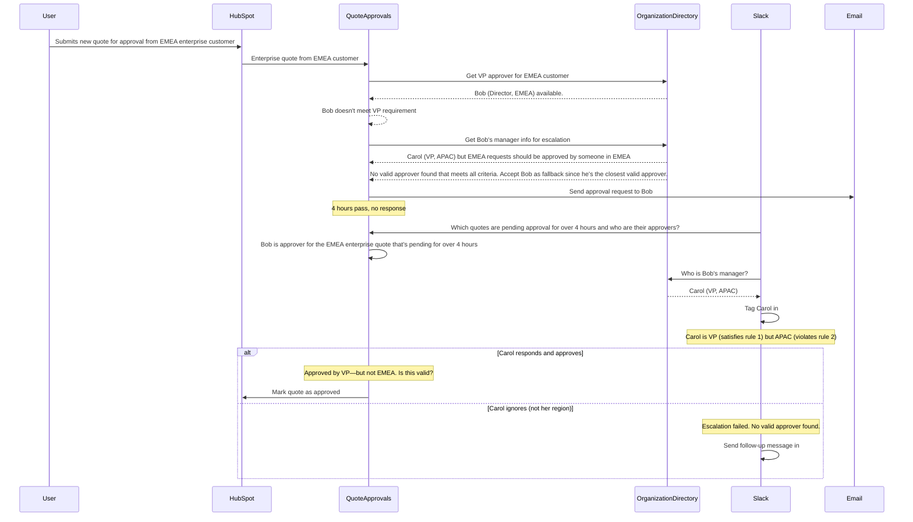

# Example: HubSpot Automated Quote Approval

## Problem statement

Automate your HubSpot quote approval workflow to close deals faster and kick up your sales efficiency.

https://zapier.com/templates/details/deal-desk-manage-hubspot-quote-approvals-slack

## Template

1. A sales rep submits a new quote for approval in HubSpot Quotes
1. The system identifies approvers based on the specific concessions asked for and the rep's reporting chain
1. An email approval request gets sent to the designated approvers
1. The approver reviews the quote details and takes action—approve, reject, or request changes—in Slack
1. If approved, the quote is marked as such in HubSpot, and the rep is free to send it
1. If concessions aren't approved, the quote is marked rejected, and reps can resubmit
1. If quotes aren't approved in 24 hours, stakeholders are tagged in the thread as a reminder

## Grounded steps

1. A sales rep submits a new quote for approval in HubSpot Quotes
1. The system identifies approvers based on the specific concessions asked for and the rep's reporting chain
1. An email approval request gets sent to the designated approvers
1. The approver reviews the quote details and takes action—approve, reject, or request changes—in the #quote-approvals channel on Slack
1. If approved, the quote is marked as such in HubSpot, and the rep is free to send it
1. If concessions aren't approved, the quote is marked rejected, and reps can resubmit
1. If quotes aren't approved in 24 hours, the Deal Desk Team is tagged in the thread as a reminder

## System objects and relationships

## Sequence diagrams

### Base scenario

A new quote is submitted for approval; a quote approval request is created in HubSpot; the system identifies approvers; an approver approves in Slack, quote gets marked as approved in HubSpot.

### Scenario: Simple conflict resolution

**Modification 1 (to QuoteApprovals):**

<mark>Quotes under $10K auto-approve</mark>

**Modification 2 (to Slack):**

"==All approvals must be posted to #quote-approvals with approver name=="

In this scenario, the system receives two conflicting instructions: QuoteApprovals is told to auto-approve quotes under $10K, while Slack is told that all approvals must be posted in #quote-approvals with the approver's name. Yet, autoapproved quotes won't have an approver name to post in Slack. The system needs to determine how to handle this conflict. 

With traditional code based programs, the unavailability of the approver name for auto-approved quotes would likely be an edge case that isn't handled, resulting in errors or missing notifications in Slack.

### Scenario with modification: Retroactive modification

**Modification (to QuoteApprovals):**

=="Effective immediately, any concessions involving discounts over 20% require CFO approval"==

A modification is made to the system that requires retroactive changes to existing quotes in the approval pipeline. With traditional programming paradigm requiring updated code is not enough. A migration script is needed to update existing quotes to comply with the new logic. With natural language programming, you can simply state the new requirement and the system can automatically identify which existing quotes are affected and update them accordingly.

### Scenario with modification: Alternate approver vs. OOO routing

**Modification (to Email):**

=="If an approver is OOO, Email should route the request to their direct manager instead"==

In this example, the system is faced with conflicting instructions: an approval should be sent to the designated approver manager, if the approver is out-of-office. An approval request define an alternate approver (e.g., Bob) to route to when the primary approver (e.g., Alice) is unavailable. The system needs to determine which instruction takes precedence and how to route the approval request accordingly. Business context or system defaults may guide the decision.

**Conflict among:**
- **QuoteApprovals**: Knows alternate approver (Bob), doesn't know Alice is OOO
- **Email**: Knows Alice is OOO, doesn't know Bob is alternate
- **OrganizationDirectory**: Knows Carol is Alice's manager, doesn't know approval context

### Scenario with modification: 3 Conflicting instructions

**Modification 1 (to QuoteApprovals):**

"==Enterprise quotes must be approved by VP or above=="

**Modification 2 (to OrganizationDirectory):**

"==EMEA quotes must be approved by someone in the EMEA region=="

**Modification 3 (to Slack):**

"==If no approval in 4 hours, tag the assigned approver's manager in #quote-approvals=="

**The conflicts:**

QuoteApprovals vs. OrganizationDirectory: QuoteApprovals needs VP. OrganizationDirectory can only provide Bob (EMEA Director). No valid approver -- not a VP.
Slack vs. OrganizationDirectory: After 4 hours, Slack asks OrganizationDirectory for Bob's manager. Gets Carol (VP, APAC). Carol is VP—but not EMEA.
Slack vs. QuoteApprovals: Slack escalates to Carol. But QuoteApprovals never assigned Carol. Is Carol now the approver? Or just notified?

