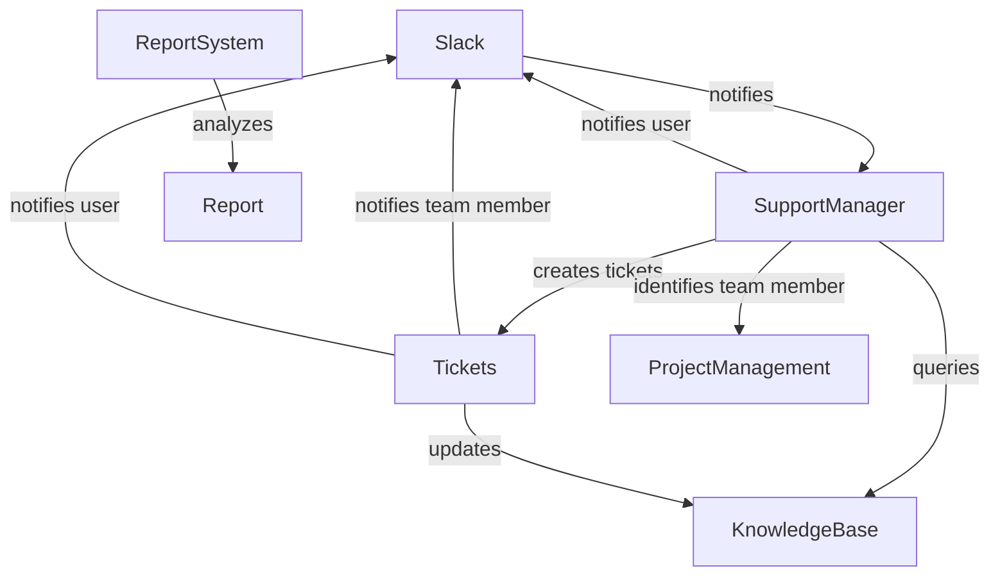
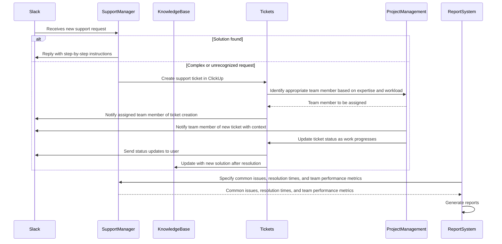
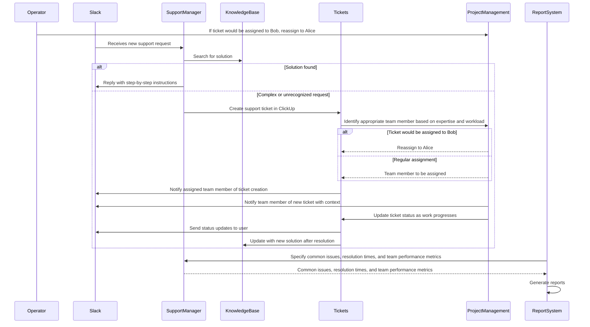
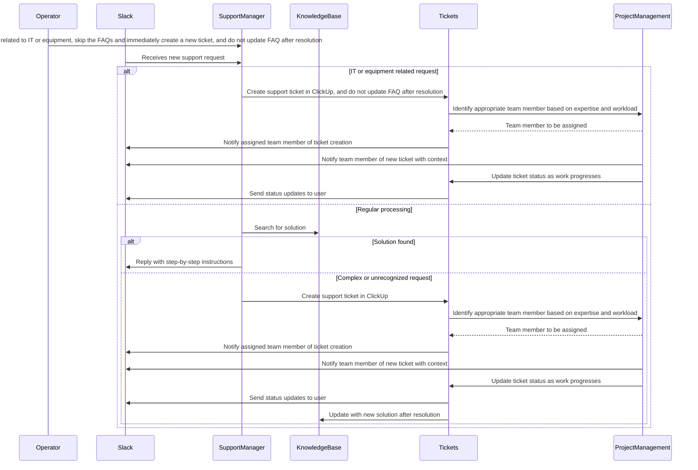

# Example: Slack-ClickUp Support Automation

## Problem statement

Transform chaotic requests and questions into an easy intake process and a knowledge base that grows itself based on your teams expertise.

https://zapier.com/templates/details/helpdesk-automation-template-slack-clickup

## Template

1. User submits support request through Slack using a simple command or form
1. AI chatbot analyzes the request and checks against your knowledge base for instant solutions
1. Common issues get resolved immediately with step-by-step instructions sent directly to the user
1. Complex or unrecognized requests automatically create tickets in ClickUp with proper categorization
1. System assigns priority levels and routes tickets to appropriate team members based on expertise and workload
1. Team members receive Slack notifications with all relevant context and can update status directly
1. Automated status updates keep users informed throughout the resolution process
1. Resolved tickets automatically update the knowledge base with new solutions for future reference
1. System generates reports on common issues, resolution times, and team performance metric

## Grounded steps

1. User submits support request through Slack using a simple command or form in #support-tickets
1. AI chatbot analyzes the request and checks against the IT Support FAQ for instant solutions
1. Common issues get resolved immediately with step-by-step instructions sent directly to the user
1. Complex or unrecognized requests automatically create tickets in ClickUp with proper categorization
1. System assigns priority levels and routes tickets to appropriate Deal Desk Team members based on expertise and workload
1. Team members receive Slack notifications with all relevant context and can update status directly
1. Automated status updates keep users informed throughout the resolution process
1. Resolved tickets automatically update the IT Support FAQ with new solutions for future reference
1. System generates reports on common issues, resolution times, and team performance metrics


## System objects and relationships



## Sequence diagram

### Base scenario (no modifications)



### Scenario with modification: "For the next 2 hours, submit a mock response for any requests marked with ##Test##"

```mermaid
sequenceDiagram
  participant Operator
  participant Slack
  participant SupportManager
  participant KnowledgeBase
  participant Tickets
  participant ProjectManagement

  Operator->>Slack: If ##Test## in request, submit mock response and skip ticket creation for 2 hours
  Slack->>SupportManager: Receives new support request
  alt ##Test## in request
    SupportManager->>Slack: Reply with mock response and skip ticket creation
  else Regular processing
    SupportManager->>KnowledgeBase: Search for solution
```

### Scenario with modification: "Bob is out sick today, reassign any tickets that would have been assigned to him to Alice"



### Scenario with modification: "New requests related to IT and equipment should skip the FAQs and immediately create tickets, and should not update the FAQ after resolution"

