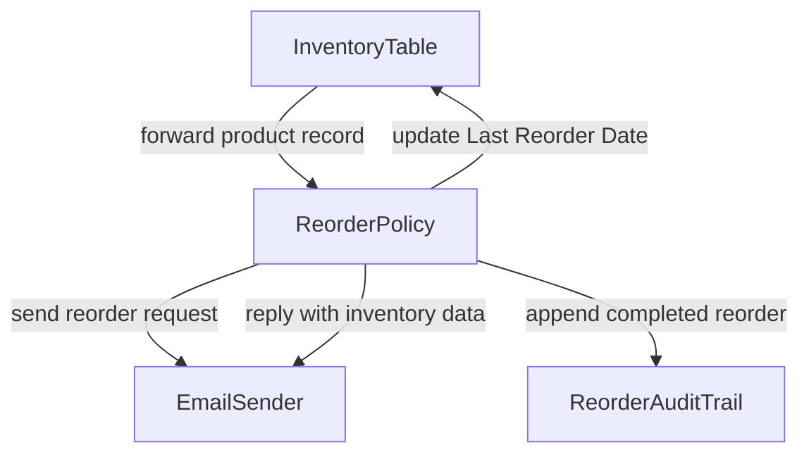
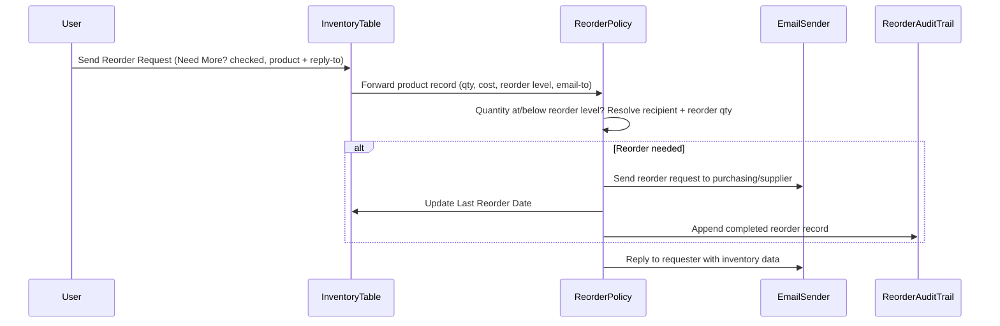
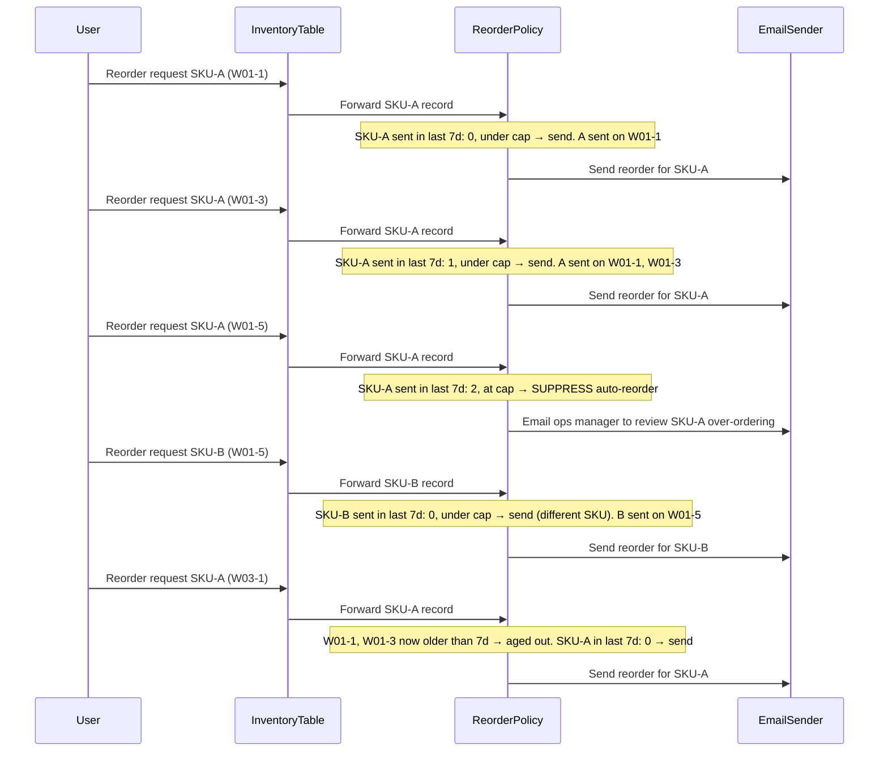

# Example: Inventory Reorder Automation

## Problem statement

Automatically check product inventory levels on request and trigger supplier reorders when stock falls at or below the reorder threshold.

https://zapier.com/templates/details/inventory

## Template

1. A request for product inventory data arrives via email with an attached form specifying the product and reply-to address.
1. The system reads the product's inventory data (quantity, cost, reorder level) from the database; if the current quantity is at or below the reorder level, it sends a reorder request to the supplier.
1. The system replies to the requester's email (using the reply-to address from the form) with the inventory data for the product.
1. If a reorder was triggered, the system updates the Last Reorder Date field in the database for that product.

## Grounded steps

1. A reorder request arrives for a product (Need More? checked), carrying the product and the reply-to address.
1. The system reads the product's inventory data (quantity, cost, reorder level); if the current quantity is at or below the reorder level, it computes the reorder quantity, resolves the recipient, and sends a reorder request to purchasing/the supplier.
1. The system replies to the requester (using the reply-to address) with the product's inventory data.
1. If a reorder was triggered, the system updates the Last Reorder Date for that product and logs the completed reorder in the audit trail.

## System objects and relationships



## Sequence diagrams

### Base scenario

A reorder request arrives for a product; the policy reads inventory data, and if quantity is at or below the reorder level it emails a reorder to purchasing, updates the Last Reorder Date, and logs it; either way it replies to the requester with the inventory data.



### Scenario: State-dependent rule — rolling reorder rate-limit

**Workflow rule (to ReorderPolicy):**

```
Record the timestamp of every reorder you send, per product SKU. Do not send more
than 2 reorders for the same SKU within any rolling 7-day window. If a reorder would
be the 3rd for that SKU within 7 days, suppress the auto-reorder email and instead
email the ops manager (ops-manager@company.com) to review possible over-ordering.
Reorders for different SKUs are independent; only reorders you actually sent count
toward the window.
```

Unlike the base flow (which decides purely from the *current* product record — quantity vs. reorder level), this rule is **value-dependent on history**: the correct action depends on how many reorders for *this same SKU* were sent inside a moving time window. The object must keep a per-SKU log of sent-reorder timestamps as state, age out entries older than 7 days, and switch behavior at the threshold — suppressing the reorder and routing to a human instead. None of that is in the incoming request; it only exists in the object's accumulated state.

With traditional programming this needs a per-SKU history table, rolling-window queries, and branch logic for suppress-vs-send — plus care that different SKUs stay independent. Here the rule is stated once and the object maintains the window itself.

#### Event sequence (SKU-A repeatedly; SKU-B independent; cap = 2 per rolling 7 days)


