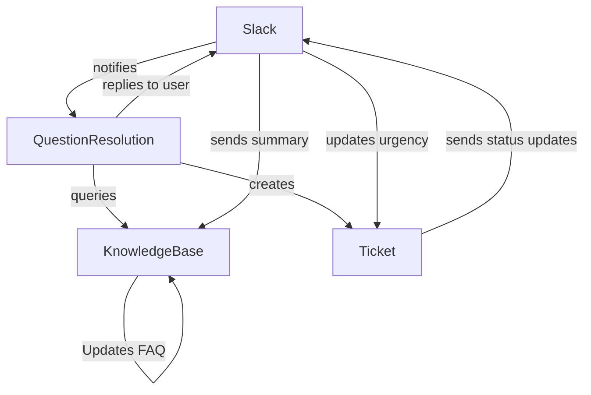
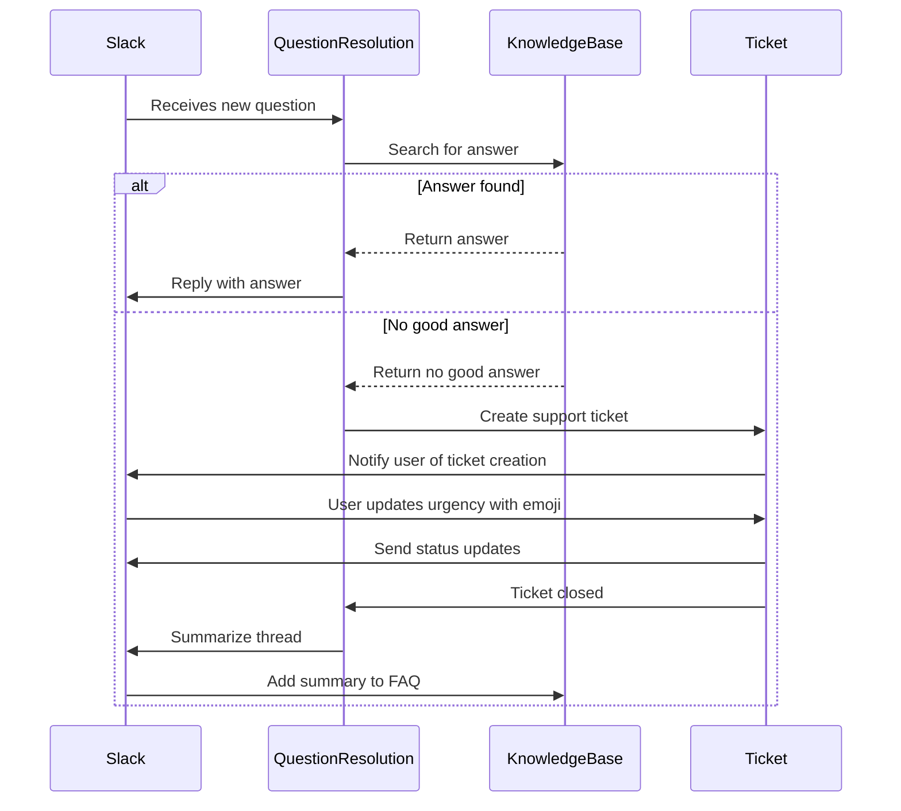
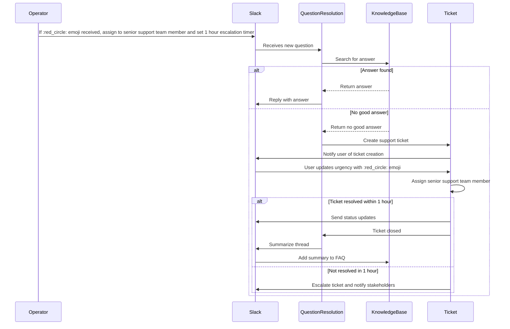
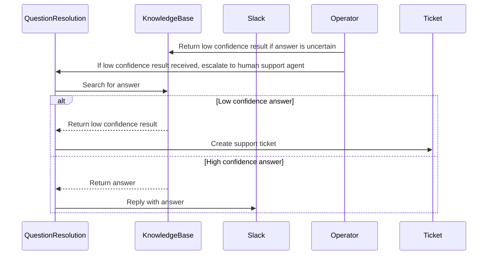
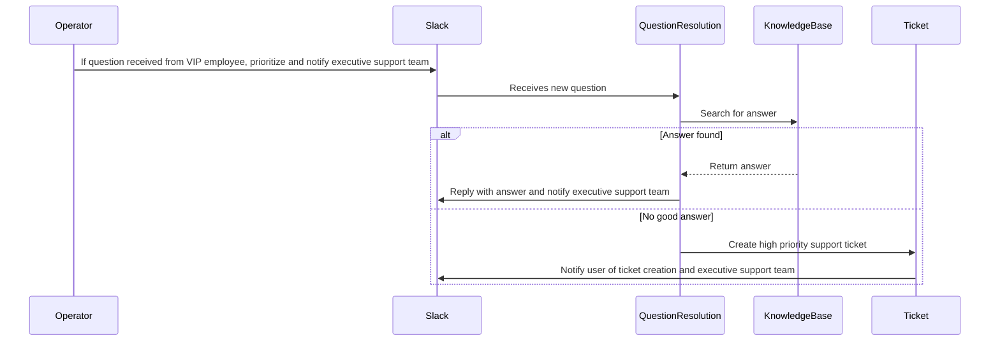
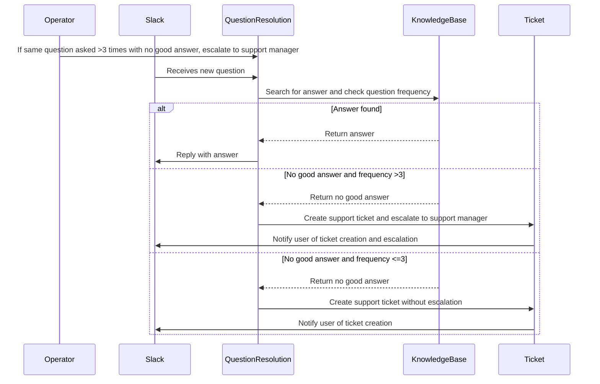
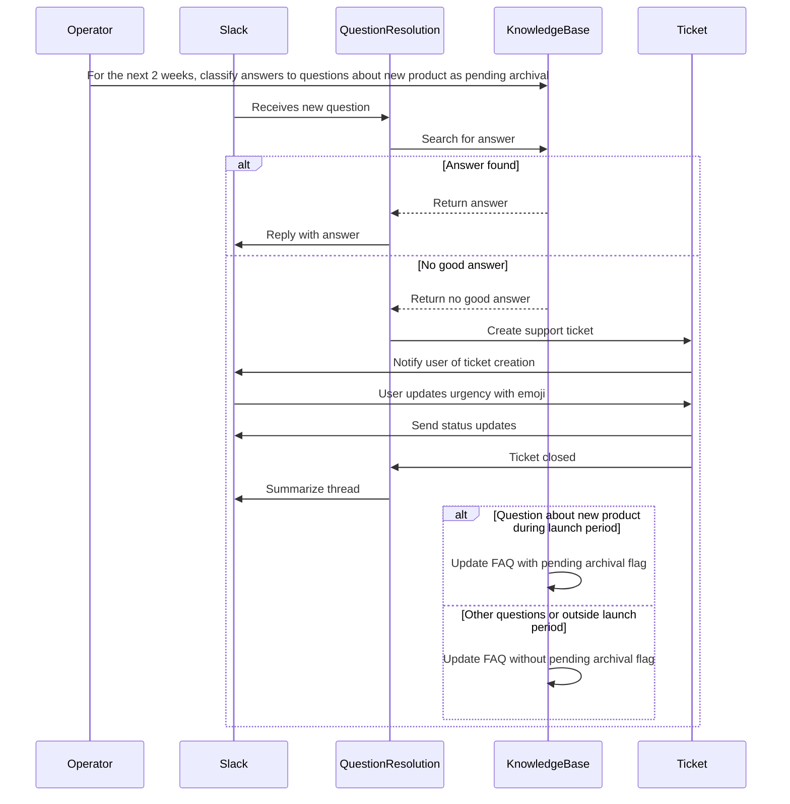

# Example: Slack-ClickUp Support Automation

## Problem statement

Transform chaotic requests and questions into an easy intake process and a knowledge base that grows itself based on your teams expertise.

https://zapier.com/templates/details/helpdesk-automation-template-slack-clickup

## Template

1. An employee posts a question in a designated Slack channel
1. AI automatically searches your FAQ knowledge base (stored in a Zapier table) for relevant answers
1. If AI finds a suitable answer, an AI chatbot replies to the employee directly in Slack
1. If AI can't find a good answer—or if the issue requires human attention—the request gets escalated to an IT team member
1. Employees can mark the urgency of their requests using an emoji that corresponds to predefined priority options
1. The system automatically creates tickets in Jira or ClickUp and sends status updates back to Slack
1. After each ticket gets closed out, the system summarizes the Slack thread and adds it to your FAQ database
1. Next time someone has the same question, AI will have the info to respond automatically

## Grounded steps
1. An employee posts a question in the #support-tickets Slack channel
1. AI automatically searches the IT Support FAQ (stored in a Zapier table) for relevant answers
1. If AI finds a suitable answer, an AI chatbot replies to the employee directly in Slack
1. If AI can't find a good answer—or if the issue requires human attention—the request gets escalated to an IT Support Team member
1. Employees can mark the urgency of their requests using an emoji that corresponds to predefined priority options: :red_circle: high, :yellow_circle: medium, :green_circle: low
1. The system automatically creates tickets in Jira and sends status updates back to Slack
1. After each ticket gets closed out, the system summarizes the Slack thread and adds it to the IT Support FAQ
1. Next time someone has the same question, AI will have the info to respond automatically

## System objects and relationships

## Sequence diagram

### Base scenario (no modifications)

### Scenario with modification: "If user marks request as high urgency, assign to senior support team member and escalate if not resolved in 1 hour"

### Scenario with modification: "If AI finds an answer with low confidence, escalate to human support agent"

### Scenario with modification: "When a question arrive from a VIP employee, prioritize it and notify the executive support team"

### Scenario with modification: "If a question has been asked more than 3 times, and has no good answer, automatically escalate to support manager"

### Scenario with modification: "For the temporal period of the upcoming product launch (2 weeks), all answers to new questions related to the new product should be automatically classified as pending archival"

  