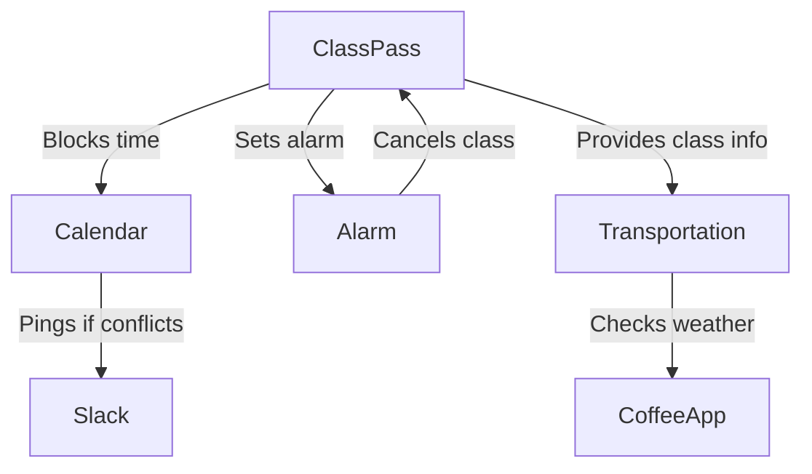
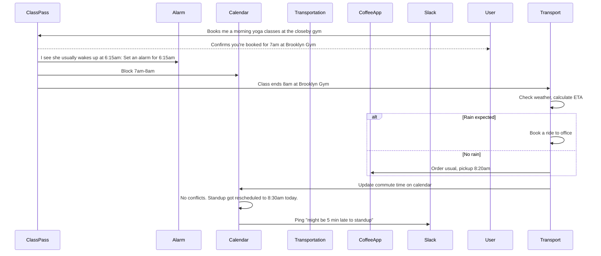
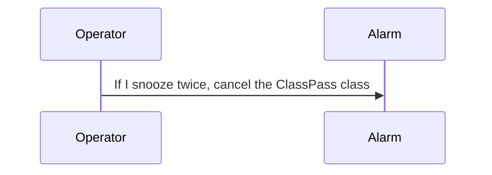
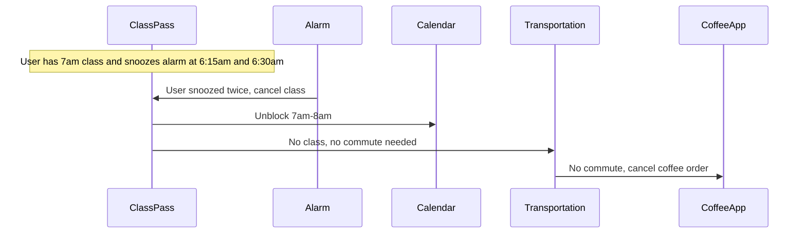
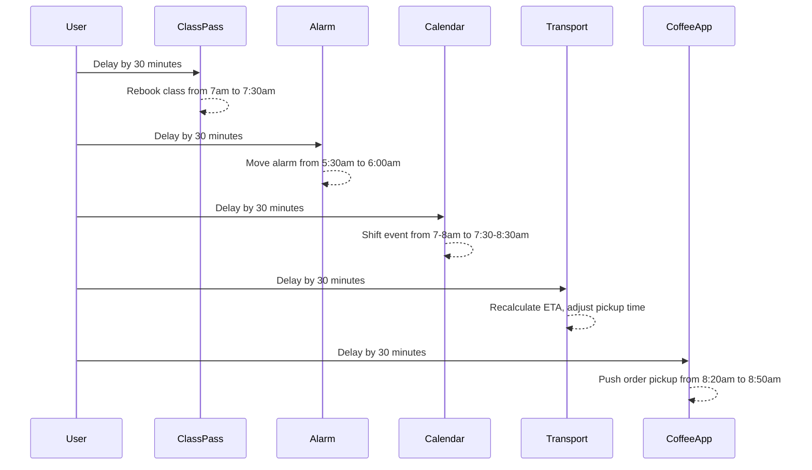

# Example: Personal Assistant Automation

## Problem statement

When I book a morning ClassPass class, set my alarm based on the class time. Block the time on my calendar—if it conflicts with standup, ping Slack. Plan my commute from the gym to the office and pre-order my usual coffee timed for pickup on the way.

## Grounded steps

1. When I book a morning ClassPass class, block that time on my calendar
1. Set my alarm based on the class time
1. If rain is expected, book an Uber from the gym to the office, otherwise I'll walk 
1. If walking, pre-order my usual coffee timed for pickup on the way. If taking a ride, skip the coffee order.
1. If the class time conflicts with my 9am standup meeting, ping #team on Slack to let them know I'll be late

## System objects and relationships



## Sequence diagram

### Base scenario

A user books a class, sets an alarm, and plans their commute and coffee order accordingly.



### Scenario: Simple modification

**Modification (to Calendar):**

```
If I snooze my alarm twice, cancel the ClassPass class
```

In this example, the user wants to add a new requirement that if they snooze their alarm twice, the system should automatically cancel their ClassPass class. This requires the Calendar object to communicate with the Alarm object to track snooze events and with the ClassPass object to cancel the class if the condition is met.
With traditional programming, this would require additional code to check the timing and conditionally execute the coffee order, whereas with natural language programming, you can simply state the new requirement and let the system handle the implementation details.

#### Modification sequence



#### New event sequence



### Scenario: Smeantic Polymorphism

**Modification:**

```
Delay by 30 minutes
```

In this example, the user passes the same instruction to different llm-objects. Same instruction, different behavior based on context. 
In a traditional programming paradigm, this would likely require additional code to handle the new instruction for each object, and the system might not be able to generalize the instruction across different contexts without explicit programming. With natural language programming, you can simply state the new instruction once, and the system can interpret and apply it appropriately across all relevant objects based on their responsibilities and relationships.

#### New event sequence


