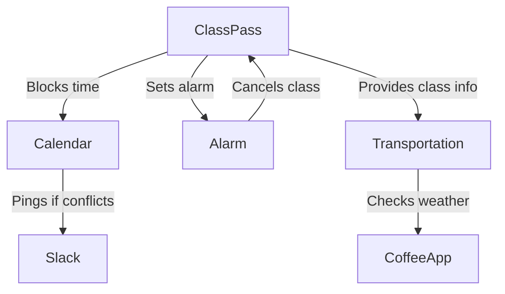
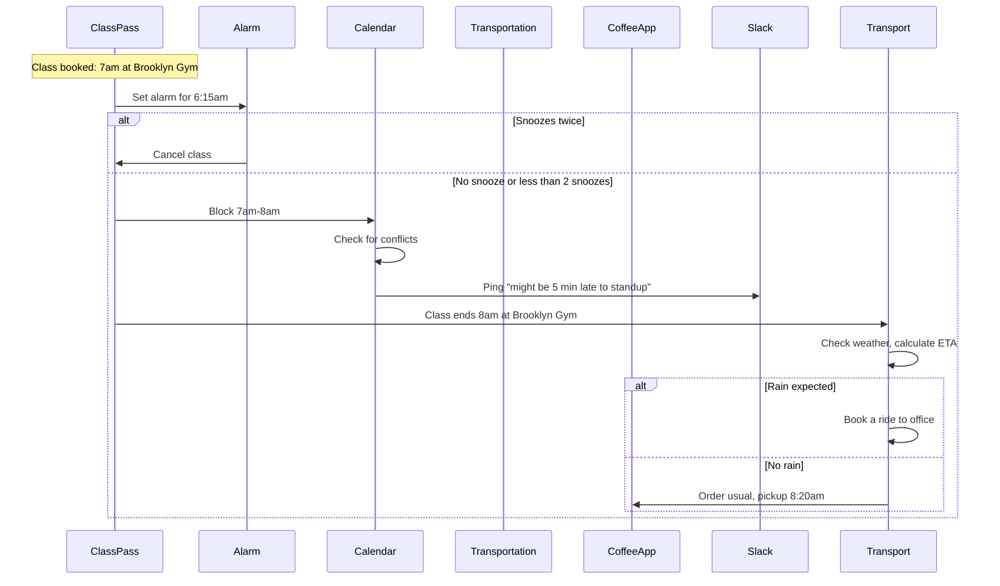
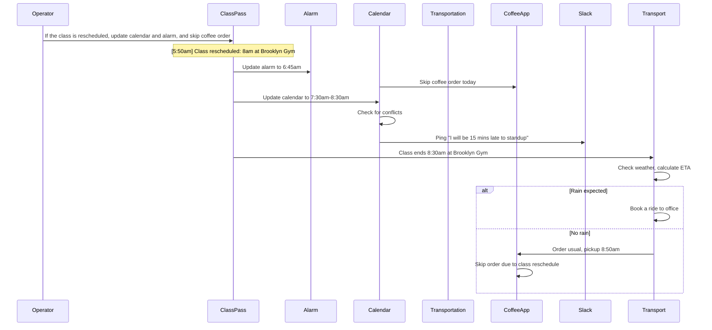
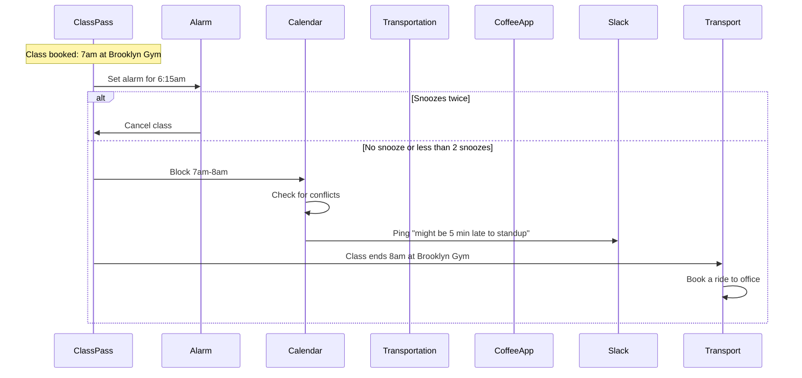

# Example: Personal Assistant Automation

## Problem statement

When I book a morning ClassPass class, set my alarm based on the class time. If I snooze twice, cancel the class. Block the time on my calendar—if it conflicts with standup, ping Slack. Plan my commute from the gym to the office and pre-order my usual coffee timed for pickup on the way.

## Grounded steps

1. When I book a morning ClassPass class, block that time on my calendar
1. Set my alarm based on the class time
1. If I snooze my alarm twice, cancel the ClassPass class
1. If rain is expected, book an Uber from the gym to the office, otherwise I'll walk 
1. If walking, pre-order my usual coffee timed for pickup on the way. If taking a ride, skip the coffee order.
1. If the class time conflicts with my 9am standup, ping #team on Slack to let them know I'll be late

## System objects and relationships

## Sequence diagram

### Base scenario (no modifications)

### Scenario with modification: "If the class is rescheduled to 8am, update my calendar and alarm accordingly, and skip the coffee order since I'll be leaving later"

### Scenario with modification: "It's too hot this week, book a ride anyhow"

