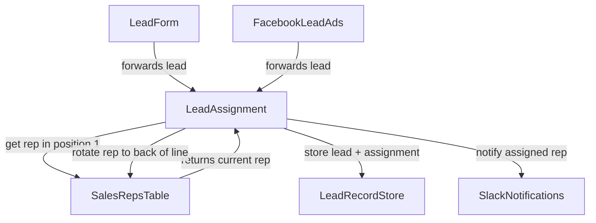
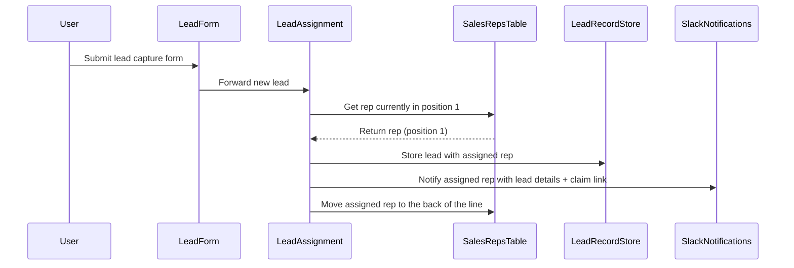
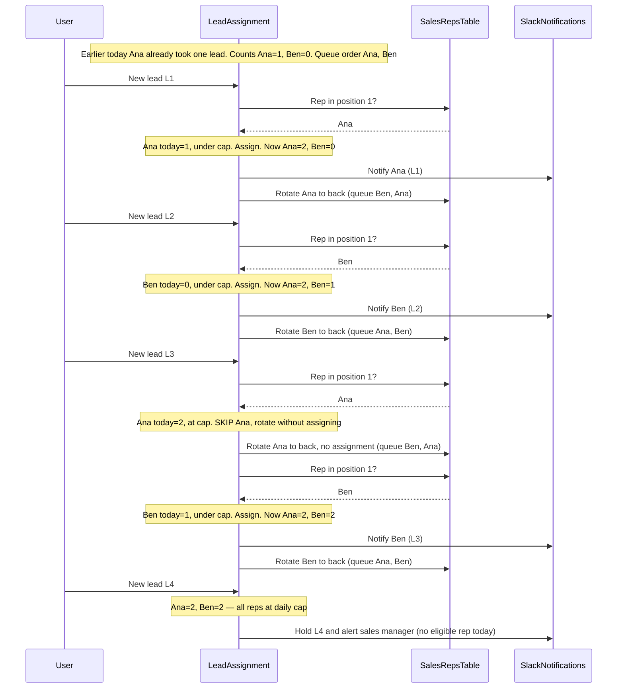

# Example: Round Robin Lead Assignment

## Problem statement

Automatically distribute incoming leads evenly across your sales team by rotating assignments through a round-robin queue.

https://zapier.com/templates/details/round-robin-lead-assignment

## Template

1. Capture lead information through a customizable form on a lead capture page.
1. The sales reps table maintains current representatives and their positions; positions are automatically updated when a new rep is added or an existing rep is removed.
1. Retrieve the sales rep currently in position 1 when a new lead is submitted.
1. Assign the new lead to the sales rep in position 1.
1. Move the assigned sales rep to the back of the line to rotate positions.

## Grounded steps

1. A prospect submits lead information through the lead capture form (or a Facebook Lead Ad).
1. The sales reps table holds the current representatives in ordered queue positions; positions shift when a rep is added or removed.
1. When a new lead arrives, retrieve the sales rep currently in position 1.
1. Assign the new lead to that rep, store the lead record, and notify the rep in Slack with the lead details and a claim link.
1. Move the assigned rep to the back of the line so the next lead goes to the following rep.

## System objects and relationships



## Sequence diagrams

### Base scenario

A lead is submitted; the round-robin logic assigns it to the rep currently in position 1, stores the record, notifies that rep, and rotates them to the back of the line.



### Scenario: State-dependent rule — per-rep daily cap

**Workflow rule (to LeadAssignment):**

```
Assign leads round-robin, but no rep may receive more than 2 leads per day.
When the rep in position 1 has already been assigned 2 leads today, skip them
(rotate to the back without assigning) and assign the next eligible rep. If every
rep has hit the daily cap, do not auto-assign — hold the lead and alert the sales
manager. Reset the per-rep daily counts at the start of each day.
```

Unlike the base round-robin (which depends only on *who* is in position 1), this rule is **value-dependent**: the correct action depends on a running count of leads each rep has received *today*. The object must carry that counter as state across every lead it handles, compare it against the cap, and change behavior at the threshold — skipping a capped rep, and eventually holding when all reps are exhausted. The counter is not in any single lead's payload; it only exists in the object's accumulated state.

With traditional programming this would require an explicit per-rep daily counter, a reset job at day boundaries, and branch logic for "skip" vs. "hold all-capped" — each an edge case that must be hand-coded. Here the rule is stated once and the object maintains the state itself.

#### Event sequence (two reps, Ana and Ben; cap = 2/day)


