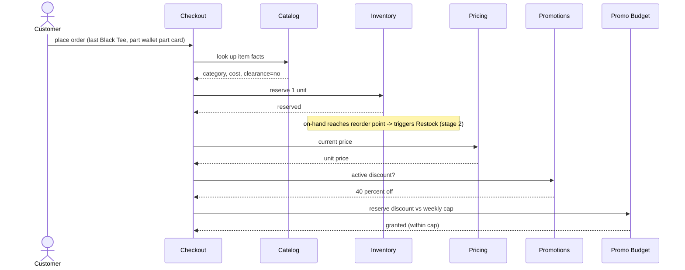
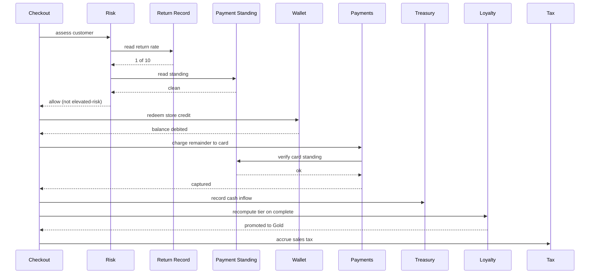
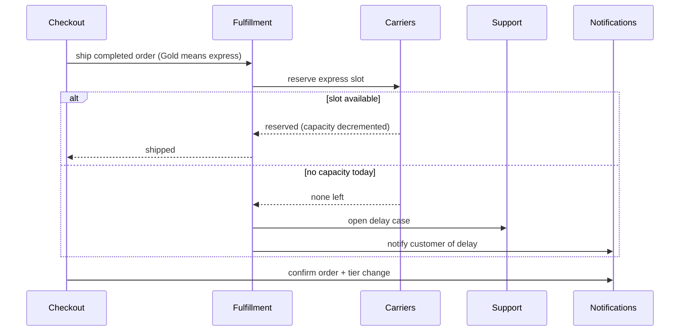
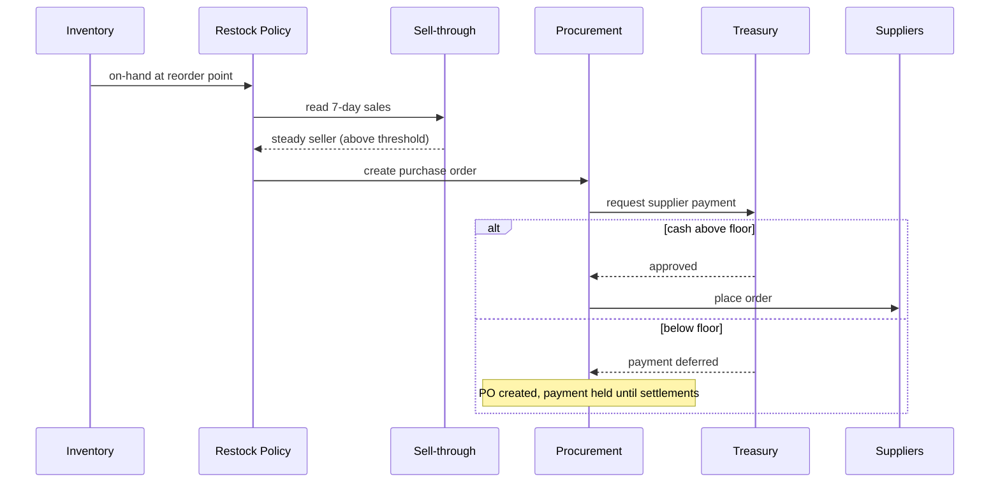
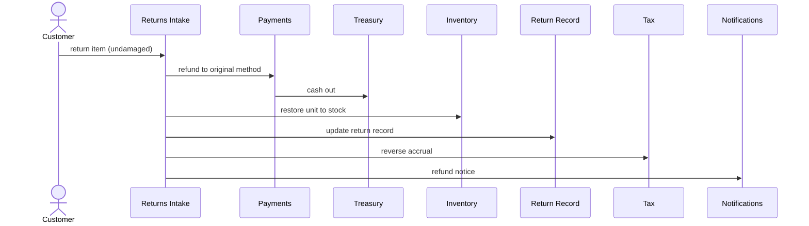
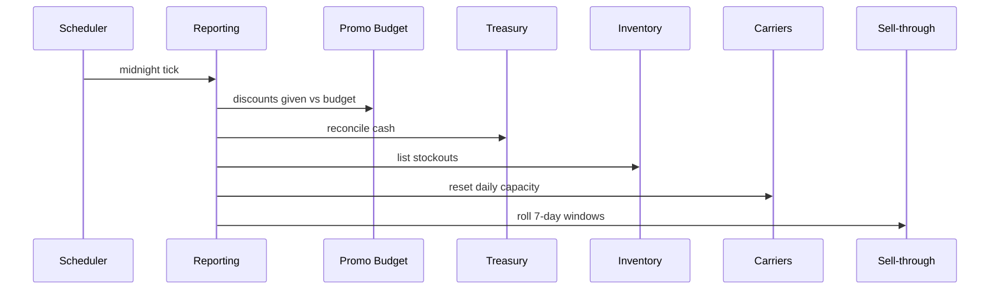

# Example: The Self-Running Storefront

A generic online store that runs itself. No human watches the normal flow. Every
event — a customer clicks "buy," a return arrives, a supplier confirms, the clock
strikes midnight — is resolved by applying a fixed set of plainly-written
**policies** to the **histories** the store continuously keeps. Humans are pulled
in only when a policy explicitly escalates. The policies themselves can be
rewritten while the store is live, without resetting any history.

This document is the **program**: the state, the rules, a concrete seed, and an
event timeline. It is the baseline from which the LLM-objects are later derived —
so no object decomposition appears here, only the behavior.

## Governing principle: zero deliberate ambiguity

This is a benchmark. **Every event resolves to exactly one correct outcome,
derivable from the state plus the stated rules.** Every threshold is an exact
number sitting at the edge where the state actually decides the case — no number
is "far enough" to be slack. The difficulty is never "it's a judgment call"; the
difficulty is that the right answer depends on a dozen interacting histories, on
the **order** events arrive, and on **cascades** the event itself sets off. Where
a policy escalates to a human, the **judgeable outcome is the escalation itself**
(e.g. "HELD, routed to review, nothing charged") — not whatever the human later
decides, which is outside the test boundary.

---

## The histories the store keeps (its running state)

The store never decides from scratch. At every moment it holds:

- **Per-product stock** — units available now, and units reserved-but-not-shipped.
- **Per-product 7-day sell-through** — units of each item sold in the last 7 days.
- **Catalog facts** — price, store cost, category, weight, and whether the item is
  **clearance/final**.
- **Live prices and active promotions** — current price per item; which discounts
  run this week and their limits.
- **This week's promotion budget** — discount dollars already given away vs. a cap.
- **Per-customer lifetime spend** — cumulative spend, which sets the loyalty tier.
- **Per-customer return record** — how many of the last 10 orders were returned.
- **Per-customer wallet** — store-credit balance (from refunds/goodwill); never
  negative.
- **Per-customer payment standing** — bounced-payment / chargeback flags and dates.
- **The store's cash position today** — running ledger: card settlements in,
  refunds out, supplier payments out.
- **Per-carrier capacity today** — shipments each carrier will still accept today.
- **Open supplier orders (POs)** — placed restocks, expected arrival, lateness.
- **Open support cases** — customer issues in flight, each tied to an order.
- **Tax accruals** — sales tax owed, accumulating per order by jurisdiction.

---

## The rule book (hardened — exact thresholds)

1. **Reservation.** An order commits only if every line reserves against live
   stock. Reserving a unit that **leaves available at or below the reorder point
   (4)** — including the last unit — triggers a **restock evaluation** for that
   item.

2. **Restock.** On a restock evaluation, **reorder** iff: available ≤ **reorder
   point (4)** AND 7-day sell-through ≥ **10** AND the item is **not clearance**.
   Reorder quantity = 2× the 7-day sell-through. Otherwise do not reorder.

3. **Promotion budget.** Applying an item's active discount requires reserving the
   discount amount against the week's remaining budget. **Reserve atomically**: if
   `spent + held + this_discount > cap`, **deny** (no discount; escalate to a
   manager for a budget exception). Reservations from in-flight orders count as
   held until the order commits or voids.

4. **Loyalty.** Tier is a function of **cumulative spend**: Silver ≥ **$1,000**,
   Gold ≥ **$5,000**. **Spend = the order subtotal after discounts, excluding
   tax, regardless of payment method** — wallet-paid amounts still count (so
   Dana's $132 line counts as $132, the $40 wallet does not reduce it). Spend
   counts only on a **completed** order (held/voided orders do not count). Gold
   perks: **free express shipping** and promo early access. Tier is recomputed
   only after an order completes.

5. **Risk / returns.** A customer is **elevated-risk** if EITHER their return rate
   over the last 10 orders is **≥ 50%** OR they carry an **unresolved
   bounced-payment/chargeback flag dated within 90 days**. For an elevated-risk
   customer, the order is **HELD for review** iff ALL hold: the order contains the
   **last available unit** of an item, AND the **restock rule will not reorder
   that item**, AND that **line's value ≥ $100**. Elevated-risk but not all three
   → **allow + flag**. Not elevated-risk → **allow**.

6. **Payment & wallet.** A customer may apply store credit up to their wallet
   balance (wallet never goes negative); credit redeemed brings in **no new cash**
   (it settles a debt already owed). The remainder is charged to card; a declined
   card **voids** the order and releases all reservations.

7. **Treasury.** Cash floor = **$2,000**. A supplier payment or other discretionary
   outflow that would drop today's cash **below the floor is HELD** (the PO is
   created but payment deferred) until settlements raise cash. Refunds are not
   discretionary and are always paid.

8. **Fulfillment & carriers.** A completed order ships via a carrier with remaining
   capacity today, preferring the **cheapest that meets the delivery promise**;
   Gold (or any order under an active express-priority rule) forces **express**.
   If no eligible carrier has capacity, **HOLD the shipment**, alert fulfillment,
   and open a support case.

9. **Returns intake.** On a returned item: refund the customer (to original
   payment method), restore the unit to sellable stock if undamaged, update the
   customer's return record, and reverse the order's tax accrual.

10. **Tax.** Every completed order accrues sales tax at the customer's jurisdiction
    rate (**8%** baseline). Refunds reverse the corresponding accrual.

11. **Notification.** Every customer-visible state change — order confirmed, held,
    shipped, refunded, promoted to a tier — emits a notification to the customer.

12. **End-of-day close.** At midnight: reconcile cash, summarize discounts given
    vs. budget, list items that hit zero, list every escalation, reset per-carrier
    daily capacity, and roll the 7-day sell-through windows.

---

## Seed snapshot — Thursday, 14:00

**Catalog / stock / sell-through**

| item | price | cost | category | clearance | available | reserved | 7-day sales |
|---|---|---|---|---|---|---|---|
| Alpine Jacket M | $220 | $130 | Outerwear | **yes** | **1** | 0 | **1** |
| Black Tee | $25 | $8 | Basics | no | **5** | 0 | **60** |
| Trail Boot 42 | $160 | $95 | Footwear | no | 12 | 0 | 18 |

**Promotions** — active: 40% off Outerwear this week. **Budget: $9,850 of $10,000
spent → $150 remaining.**

**Customers**

| customer | lifetime spend | tier | returns (last 10) | payment flag | wallet | jurisdiction |
|---|---|---|---|---|---|---|
| **Dana** | **$4,880** | Silver | **6 / 10** | bounced, **60 days ago** | **$40** | 8% |
| Omar | $7,300 | Gold | 0 / 10 | none | $0 | 8% |
| Priya | $2,100 | Silver | 1 / 10 | none | $0 | 8% |

**Treasury** — cash today: **$2,150** (morning refunds drew it down). Floor $2,000.

**Carriers** — Express-1: **1** slot left today. Ground-1: 50 slots left.

---

## Event timeline (Thursday)

Each event lists the cascade it sets off and the single judgeable outcome.

### T1 — 14:14:02.100 — Dana clicks "buy": 1 × Alpine Jacket M

She elects to pay **$40 from her wallet**, remainder on card. The 40% promo makes
the line **$132** ($88 off).

Cascade:
- **Reserve** the jacket → available 1→0 → fires a **restock evaluation** for the
  jacket.
- **Restock eval:** available 0 ≤ 4 ✓, but 7-day sell-through **1 < 10** ✗ (and
  clearance) → **do not reorder.**
- **Promotion budget:** reserve $88 against $150 free → `9850 + 88 = 9938 ≤ 10000`
  → **granted (held pending the order).** Free budget now $62.
- **Risk:** Dana is elevated-risk (6/10 ≥ 50%, and a 60-day payment flag). The
  order holds the **last unit** of the jacket, the **restock rule won't reorder**
  it, and the line is **$132 ≥ $100** → **all three true → HOLD for review.**
- Because the order is **held, not completed:** loyalty does **not** recompute
  (she stays Silver, no Gold), nothing ships, no card charge, no wallet debit.

**Expected outcome:** order **HELD, routed to review**; jacket reserved (0
available); **no reorder**; **$88 discount reserved** (budget free → $62); card
**not** charged; wallet **not** debited ($40 intact); Dana **not** promoted; one
"order held" notification.

### T1′ — 14:14:02.150 / .200 / .250 — three other customers check out discounted Outerwear

Each is a different Outerwear item, but each discount is **> $62** (e.g. $88, $96,
$72), arriving just after Dana — so none can fit the headroom she left.

- Each tries to reserve its discount against the **$62** now free → each exceeds
  $62 → **denied** for all three.

**Expected outcome:** all three discounts **denied → escalated to a manager**
(offered at full price); budget never exceeds the cap. *(Whoever reserved first —
Dana — won the only remaining slot; this is decided by arrival order, not by any
property of the orders.)*

### T2 — 14:20 — Omar (Gold) checks out: 1 × Trail Boot 42 ($160) + 1 × Black Tee ($25)

- **Reserve** both. Trail Boot 42 12→11 (11 > 4, no eval). Black Tee 5→4, which is
  at the reorder point → fires a **restock evaluation**.
- **Restock eval (Tee):** available 4 ≤ 4 ✓, 7-day sell-through **60 ≥ 10** ✓, not
  clearance ✓ → **reorder**, quantity 2×60 = **120 units** (supplier cost
  120×$8 = **$960**). A PO is drafted.
- **Treasury check on the $960 PO:** cash $2,150 + Omar's inflow this order. Order
  subtotal $185, tax 8% = $14.80, total **$199.80** charged to card → cash
  **$2,349.80**. `2349.80 − 960 = 1389.80 < 2000` floor → **PO payment HELD**
  (PO created, payment deferred, alert raised).
- **No risk hold** (Omar 0/10, no flag). Order **completes**.
- **Loyalty:** Omar already Gold; spend updates, tier unchanged.
- **Fulfillment:** Gold → **express** → assign **Express-1**, its **last slot** →
  Express-1 capacity **1→0**.
- **Tax** accrued $14.80. **Notification:** confirmed + shipped.

**Expected outcome:** order **completes**; Tee **reorder PO created but payment
held by treasury**; jacket-style contrast (Tee reorders, jacket did not); cash
**$2,349.80**; Express-1 capacity **0**; tax accrued; shipped + confirmed
notifications.

### T3 — 14:35 — Priya's earlier Trail Boot 42 arrives as a return (undamaged)

- **Refund** $160 + reverse $12.80 tax = **$172.80** to her card (refunds are not
  discretionary — paid even though cash is tight) → cash `2349.80 − 172.80 =
  2177.00`.
- **Restore** 1 undamaged unit → Trail Boot 42 available 11→12 (11 after Omar's
  T2 purchase).
- **Update** Priya's return record (now 2/10) — still below the 50% risk line.
- **Reverse** the tax accrual.

**Expected outcome:** $172.80 refunded; stock restored (**12**); return record
updated; tax reversed; cash **$2,177.00**; refund notification.

### T4 — 14:50 — a second Gold customer's order needs express, but Express-1 is full

- Order completes on all other checks; Gold forces **express**; Express-1 capacity
  is **0**; no other carrier offers express today.

**Expected outcome:** **shipment HELD**; fulfillment alerted; **support case
opened** and linked to the order; customer notified of the delay. *(A consequence
purely of T2 having taken the last express slot minutes earlier.)*

### T5 — 00:00 Friday — end-of-day close

**Expected outcome (reconciliation):** cash reconciled to **$2,177.00**; discounts
given/held = **$88 of the $10,000 budget reserved**, **3 discounts denied**; items
that hit zero = **Alpine Jacket M**; escalations listed = **Dana HELD**, **3
budget denials**, **Tee PO payment held by treasury**, **one express shipment
held**; **Express-1 capacity reset**; **7-day windows rolled**.

---

## The runtime rewrite — Friday 00:00, broadcast to the live store

No restart, no redeploy, **histories untouched**:

> *"Black Friday weekend. (a) Triple the promotion budget to **$30,000**. (b) Treat
> clearance items as **restockable**. (c) **Prioritize express** carriers for all
> tiers, not just Gold. (d) Suspend risk-HOLDs for elevated-risk customers whose
> **order total is under $200** — allow-and-flag instead."*

Re-resolving **the same Dana click** under the new rules — same $4,880 spend, same
6/10 returns, same $40 wallet, all carried straight through:

- **(a)** $88 fits with room under $30,000 — **granted**, and the three concurrent
  checkouts now also fit.
- **(b)** The jacket's last-unit restock now **fires** (clearance is restockable).
- **(d)** Dana's order total **$132 < $200** → her risk-HOLD is **suspended →
  allow + flag**. The order **completes.**
- **Loyalty:** completion ticks spend to **$5,012 ≥ $5,000 → promoted to Gold.**
- **(c) + Gold:** ships **express.**
- **Wallet/cash:** $40 redeemed → **no new cash** for that $40; card collects
  $92 + tax; the order brings in less actual cash than its sticker — the wallet
  rule now visibly bites.

**Same input, completely different deterministic cascade**, and every long-running
history survived the rule change intact. This is the capability a redeploy-bound
microservice stack cannot offer: the rules changed mid-flight while the state ran
on.

---

## What this program exercises (latent, for later derivation)

A single click, and a return, and a midnight tick, between them touch: catalog,
stock, sell-through, promotions, the promo **budget cap** (a contended
aggregate), reservations, risk/returns, the customer wallet, payments, the **cash
ledger** (a treasury floor that gates restocks), loyalty tiers (an aggregate that
**the order itself moves**), fulfillment, **carrier capacity** (a daily pool),
procurement/suppliers, tax, notifications, support, and end-of-day reporting —
each owning a distinct history and a slice of the rule book. The objects fall out
of this program; they are not designed before it.

---

## Object map — the example as a sequence, split by stage

The same full object set, rendered as **sequence diagrams** of one composite
business day (one completed order, a return, the midnight close, and the runtime
rewrite). Split into the stages each event drives so no single diagram gets too
wide; every object appears as a participant in at least one stage. External actors
— Customer, Scheduler, User — sit outside the object set.

### Stage 1a - Order: decide & reserve



### Stage 1b - Order: risk gate, pay & complete



### Stage 1c - Order: ship & notify



### Stage 2 - Restock & procurement (triggered by stage 1a)



### Stage 3 - Return



### Stage 4 - End-of-day close



### Stage 5 - Runtime rewrite (programmable-online)

```mermaid
sequenceDiagram
  actor User
  participant BUD as Promo Budget
  participant RST as Restock Policy
  participant FUL as Fulfillment
  participant RSK as Risk
  User->>BUD: triple weekly cap
  User->>RST: treat clearance as restockable
  User->>FUL: express for all tiers
  User->>RSK: suspend holds under 200
  Note over BUD,RSK: rules change at runtime; the long-running state runs on
```

Across the stages the same ~24 objects recur as participants; `Treasury`,
`Inventory`, and `Sell-through` reappear in several stages — which is exactly why
they are single shared owners, not per-event copies.
